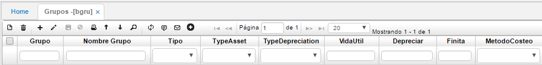
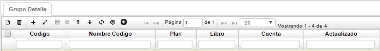
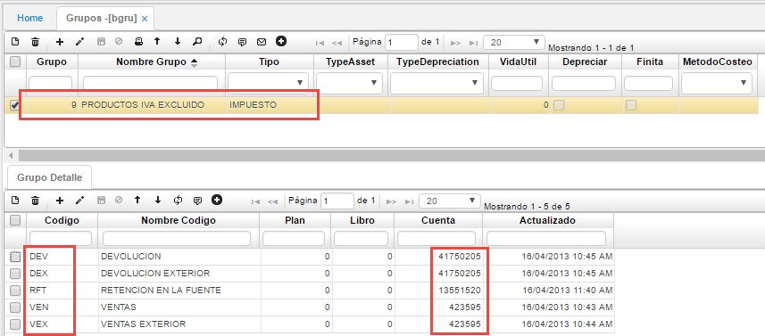
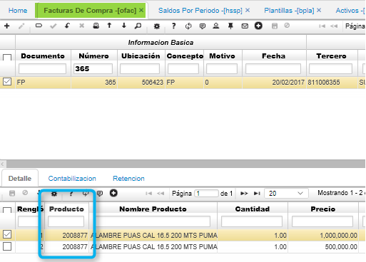
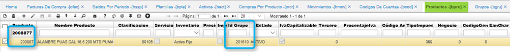
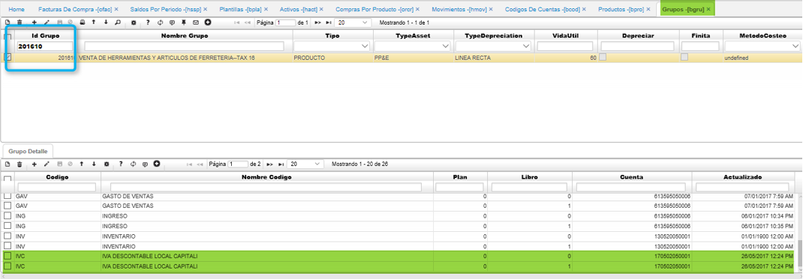
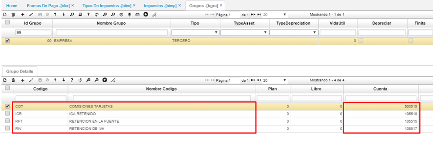

# Grupos - BGRU

La aplicación **BGRU** permite crear grupos, en los cuales, según la parametrización que contenga en el detalle, indicará que cuentas contables afectará al momento de causar impuestos.  

**Grupo:** Número del grupo que se desea crear.  
**Nombre grupo:** Nombre del grupo que se desea crear.  
**Tipo:** Tipo de grupo, es decir, si es un producto, activo, tercero, cargo, ubicación, impuesto o ninguno.  
**Tipo de activo:** En caso tal que en el campo anterior se haya seleccionado tipo activo, se debe indicar de la lista desplegable que tipo de activo es: PP&E, P. Inversión, Construcción, Intangibles, Activos E&E, Activo Biológicos, Activo MV o ninguno.  
**Tipo depreciación:** Seleccionar de la lista desplegable tipo de depreciación: línea recta, suma dígitos, unidades producidas, reducción de saldos.  
**Vida útil:** Si se requiere indicar años de vida útil.  
**Depreciar:** Según como se requiera se marca el Check.  
**Finita:** Según como se requiera se marca el Check.  
**Método costeo:** Método de costeo razonable o costo.  

_Detalle_  

**Código:** Código de la cuenta contable que afectará el grupo. Código parametrizado en **BCOD**.  
**Nombre código:** Nombre del código ingresado anteriormente.  
**Libro:** Número del libro en el cual afectará los movimientos del grupo.  
**Cuenta:** Número de cuenta contable la cual se verá afectada en los movimientos que se realicen con dicho grupo.  

Por ejemplo, si se crea un grupo para los productos con IVA Excluido, este grupo tendrá que afectar las cuentas contables descritas en el detalle, quedando de la siguiente manera:  

## [Parametrización ingreso de activo fijo por compras](http://docs.oasiscom.com/Operacion/common/bcuenta/bgru#parametrización-ingreso-de-activo-fijo-por-compras)

Para el proceso de Ingreso de Activo Fijo por Compras, en la aplicación BGRU se debe incluir el código IVC a los activos fijos. A continuación un ejemplo.  

En el ejemplo el código del producto del activo fijo es 2008877, el cual se puede observar al consultar el movimiento en la aplicación [**OFAC - Facturas de Compras**](http://docs.oasiscom.com/Operacion/scm/compras/ofactura/ofac#manejo-de-iva-en-activos-fijos).  

Identificado el código del producto, lo consultamos en la aplicación [**BPRO - Productos**](http://docs.oasiscom.com/Operacion/common/bprodu/bpro) para conocer el Id del grupo al cual pertenece.  

Finalmente, identificado el grupo al cual pertenece el producto, en la aplicación BGRU incluimos el código IVC en el grupo correspondiente.  

## [Parametrización para las transferencias de dinero](http://docs.oasiscom.com/Operacion/common/bcuenta/bgru#parametrización-para-las-transferencias-de-dinero)

En la aplicación BGRU se parametriza el grupo 99 que hemos configurado previamente en la aplicación [**BIMP - Impuestos**](http://docs.oasiscom.com/Operacion/common/bimpu/bimp#parametrización-para-las-transferencias-de-dinero), allí debemos asociar los códigos de las retenciones y comisiones con sus respectivas cuentas:  

El proceso de transferencias de dinero se realiza por la aplicación [**TPTR - Transferencias**](http://docs.oasiscom.com/Operacion/erp/tesoreria/tproceso/tptr). _(Ver aplicación)_  

### [Parametrización para el módulo activos fijos](http://docs.oasiscom.com/Operacion/common/bcuenta/bgruparametrización-para-el-módulo-activos-fijos)

En esta aplicación, se entra a parametrizar cómo va a contabilizar cada uno de los movimientos del módulo:  en el primer campo, registramos el número de identificación del grupo, el nombre del grupo, el tipo del grupo contable, en este caso, se selecciona activo, cuál es el tipo del activo, es decir, si es propiedad, planta y equipo o alguno de la clasificación, cuál es el método de depreciación, la vida útil y si se van a depreciar los activos asociados a ese grupo contable

En el detalle se registran las cuentas contables correspondientes
CÓDIGO: ACF que es activo fijo
Posteriormente, cuál va a ser la cuenta contable de depreciación, cuál va a ser la cuenta contable de gasto de depreciación y por último, la del iva capitalizable, esto solo aplica cuando el valor del iva es mayor valor del activo fijo

