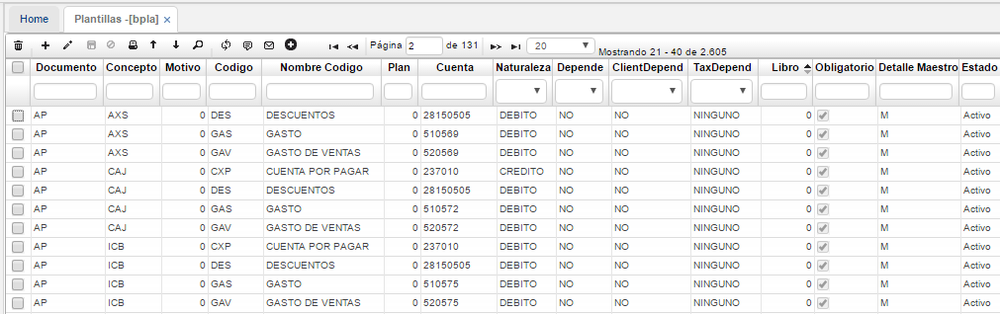
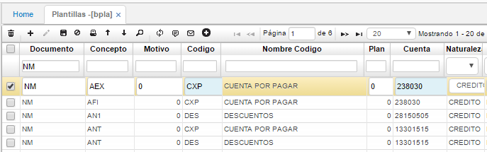
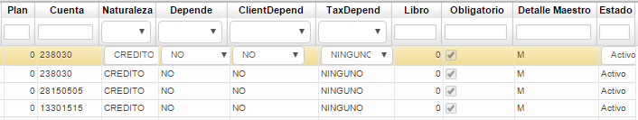
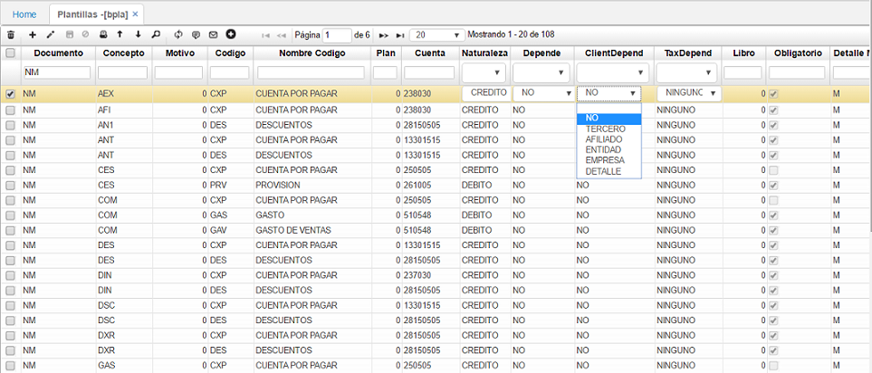
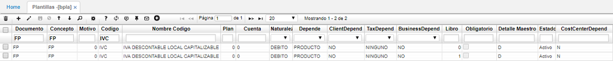

# PLANTILLAS - BPLA

La aplicación **BPLA** permite parametrizar las plantillas que se podrán utilizar en diferentes aplicaciones de Oasis, lo cual optimiza el tiempo al momento de su operación. Aquí se deben parametrizar las plantillas de cada documento por cada uno de los conceptos definidos, esto hace que cuando creemos un documento por ejemplo una CP (de cuentas por pagar) al guardar el registro, la parte inferior que se denomina el detalle se diligencia automáticamente.  

**Documento:** Tipo de documento al que se le crea la plantilla.  
**Concepto:** Concepto por el cual se genera el documento.  
**Motivo:** Motivo del documento.  
**Código:** Siglas del código o nombre de la cuenta.  
**Nombre código:** Nombre de la cuenta.  
**Cuenta:** Cuenta contable a la cual relaciona la plantilla.  
**Naturaleza:** Naturaleza de la cuenta: débito, crédito.  
**Depende:** Si la plantilla depende de un producto, activo, tercero, ubicación, impuesto, salud o ninguno.  
**Depende cliente:** Si el cliente depende de un tercero, una entidad, una empresa, un detalle o ninguno.  
**Depende de impuestos:** Igualmente permite seleccionar sobre que depende el impuesto, si de un tercero, producto, empresa, salud o ninguno.  
**Libro:** libro contable en el cual se va a operar la plantilla.  
**Estado:** estado de la plantilla.  

## [Contabilización de Nómina](http://docs.oasiscom.com/Operacion/common/bcuenta/bpla#contabilización-de-nómina)

Para efectos de la contabilización de la nómina, se parametrizan las cuentas contables a donde deben apuntar cada concepto. Se debe tener en cuenta que las plantillas se dividen en los documentos _NM – Nómina, AP – Aportes, PV – Provisión_.  

Los campos que se deben parametrizar son:

**Documento:** _NM – Nómina_, _AP – Aportes_, _PV – Provisión_.  
**Concepto:** consultar los conceptos en la opción **NBCO – Conceptos**, en donde deben estar previamente parametrizados.  
**Código:** para realizar la parametrización del código ingresamos a la opción **BCOD – Códigos**. En este campo se define si la cuenta que se va a parametrizar corresponde a un gasto administrativo, de ventas, si es una cuenta por pagar, de provisión, etc.  

Algunos códigos son:

**•**	Gasto Administrativo (Código GAS). Corresponde a la cuenta contable afectada por el tipo de gasto. Toma la cuenta de acuerdo al Tipo de Gasto parametrizado en la opción **BUBI**, cuya ubicación se asignó al empleado en la opción **NCNT - Contratos**.

**•**	Gasto Ventas (Código GAV). Es la cuenta contable afectada por el tipo de gasto, toma la cuenta de acuerdo al Tipo de Gasto parametrizado en la opción **BUBI**, cuya ubicación se asignó al empleado en **NCNT**.

**•**	Gasto Producción (Código GAP). Es la cuenta contable afectada por el tipo de gasto, toma la cuenta de acuerdo al Tipo de Gasto parametrizado en la opción **BUBI**, cuya ubicación se asignó al empleado en **NCNT**.

**•**	Cuenta Pasivo (Código CXP). Se utiliza como contrapartida de la contabilización de la cuenta descuento y es obligatoria para todos los conceptos de naturaleza Crédito definidos en el Proceso de Nómina e igualmente para todos los conceptos del Proceso de Autoliquidación.

**•**	Cuenta Descuentos (Código DES). Se utiliza una cuenta puente del plan único de cuenta que permite en el momento de generación de la nómina almacenar todos los descuentos que por cualquier motivo se realizan a los empleados, luego de confirmarse el documento AP de la nómina, estos valores son enviados a la respectiva cuenta pasivo, se utiliza únicamente durante las confirmaciones de las nóminas y es requerida en todos los conceptos del proceso de Autoliquidación y en los de naturaleza crédito del proceso de Nómina.

Es importante resaltar que estas cuentas solo deben ser incluidas para conceptos que impliquen flujo de efectivo.

**Cuenta:** cuenta contable a la cual se debe contabilizar de acuerdo al código ingresado anteriormente. Las cuentas contables deben estar previamente parametrizadas en la opción **BCUE** y debe estar activo Check Imputable.  
**ClientDepend:** Seleccionar la opción dependiendo la necesidad del concepto.

## [Parametrización ingreso de activo fijo por compras](http://docs.oasiscom.com/Operacion/common/bcuenta/bpla#parametrización-ingreso-de-activo-fijo-por-compras)

Para el proceso de Ingreso de Activo Fijo por Compras, en la aplicación BPLA se debe incluir en la plantilla del documento _FP x FP_ el código IVC tal como se muestra en la imagen.  

  

## [**Movimientos de activos fijos**](http://docs.oasiscom.com/Operacion/common/bcuenta/bpla#movimientos-de-activos-fijos)  

Primero que todo, tenga en cuenta que para realizar los movimientos de activos fijos, se deben tener en cuenta varias aplicaciones adicionales a esta **BPLA - Documentos**, a saber:  [**BDOC - Documentos**](http://docs.oasiscom.com/Operacion/common/bsistema/bdoc#movimientos-de-activos-fijos), [**BMOT - Motivos**](http://docs.oasiscom.com/Operacion/common/bsistema/bmot#movimientos-de-activos-fijos) y donde se realizan los movimientos: [**HMOV - Movimientos**](http://docs.oasiscom.com/Operacion/erp/activos/hmovimient/hmov#ingreso-de-activo-fijo-por-HMOV).  

En esta aplicación, le vamos a indicar al sistema cómo debe contabilizar cada uno de los movimientos generados:  

  

**Documento:**  Consultamos el documento MA de movimiento de activos.  
**Concepto:**  En este campo, se puede escoger de un menú que puede ver por la aplicación **HMOV** los diferentes conceptos, por ejemplo BJ(bajas), DC(Descuento pronto pago, TR(Traslado), entre otros.  En el caso de la ilustración, se elige el concepto BJ de baja.    
**Código:** En este campo, se le debe decir al sistema qué código debe causar, por ejemplo, un activo, una depreciación, una pérdida o una utilidad según corresponda.  
**Cuenta:** En el campo cuenta, se registrar la cuenta contable siempre y cuando sea la misma para todos los activos fijos; en caso de que no sea la misma, se registra 0(cero).  
**Depende:**  En el campo depende, se le dice al sistema que depende del activo fijo.  
**Naturaleza:** Se registra la naturaleza que corresponda, o sea, débito o crédito.  
**Obligatorio:**  En este campo, se le debe decir al sistema si debe causar los códigos o no; por ejemplo, si el activo ya se depreció en su totalidad, entonces solo se debe causar la cuenta del activo fijo con su respectiva depreciación.  En caso de que el activo no se haya depreciado en su totalidad, el valor restante lo debe llevar a una pérdida o utilidad según corresponda; por tal motivo, los campos que siguen no son obligatorios de diligenciar:  
**Detalle maestro:**  
**Estado:**
**Orden:**  

  

