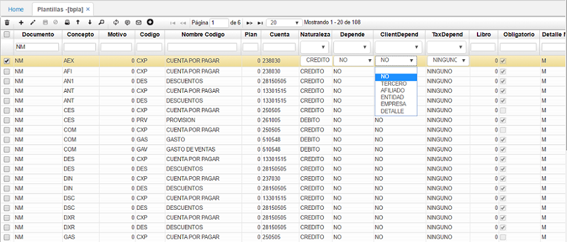

# PLANTILLAS - BPLA

Para efectos de la contabilización de la nómina, se parametrizan las cuentas contables a donde deben apuntar cada concepto. Se debe tener en cuenta que las plantillas se dividen en los documentos _NM – Nómina, AP – Aportes, PV – Provisión_.

Los campos que se deben parametrizar son:

**Documento:** _NM – Nómina_, _AP – Aportes_, _PV – Provisión_.  
**Concepto:** consultar los conceptos en la opción **NBCO – Conceptos**, en donde deben estar previamente parametrizados.  
**Código:** para realizar la parametrización del código ingresamos a la opción **BCOD – Códigos**. En este campo se define si la cuenta que se va a parametrizar corresponde a un gasto administrativo, de ventas, si es una cuenta por pagar, de provisión, etc.

Algunos códigos son:

**•**	Gasto Administrativo (Código GAS). Corresponde a la cuenta contable afectada por el tipo de gasto. Toma la cuenta de acuerdo al Tipo de Gasto parametrizado en la opción **BUBI**, cuya ubicación se asignó al empleado en la opción **NCNT - Contratos**.

**•**	Gasto Ventas (Código GAV). Es la cuenta contable afectada por el tipo de gasto, toma la cuenta de acuerdo al Tipo de Gasto parametrizado en la opción **BUBI**, cuya ubicación se asignó al empleado en **NCNT**.

**•**	Gasto Producción (Código GAP). Es la cuenta contable afectada por el tipo de gasto, toma la cuenta de acuerdo al Tipo de Gasto parametrizado en la opción **BUBI**, cuya ubicación se asignó al empleado en **NCNT**.

**•**	Cuenta Pasivo (Código CXP). Se utiliza como contrapartida de la contabilización de la cuenta descuento y es obligatoria para todos los conceptos de naturaleza Crédito definidos en el Proceso de Nómina e igualmente para todos los conceptos del Proceso de Autoliquidación.

**•**	Cuenta Descuentos (Código DES). Se utiliza una cuenta puente del plan único de cuenta que permite en el momento de generación de la nómina almacenar todos los descuentos que por cualquier motivo se realizan a los empleados, luego de confirmarse el documento AP de la nómina, estos valores son enviados a la respectiva cuenta pasivo, se utiliza únicamente durante las confirmaciones de las nóminas y es requerida en todos los conceptos del proceso de Autoliquidación y en los de naturaleza crédito del proceso de Nómina.

Es importante resaltar que estas cuentas solo deben ser incluidas para conceptos que impliquen flujo de efectivo.

**Cuenta:** cuenta contable a la cual se debe contabilizar de acuerdo al código ingresado anteriormente. Las cuentas contables deben estar previamente parametrizadas en la opción **BCUE** y debe estar activo Check Imputable.
**ClientDepend:** Seleccionar la opción dependiendo la necesidad del concepto.

