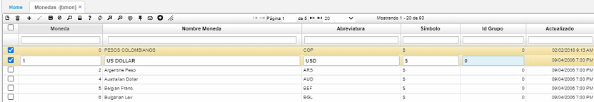
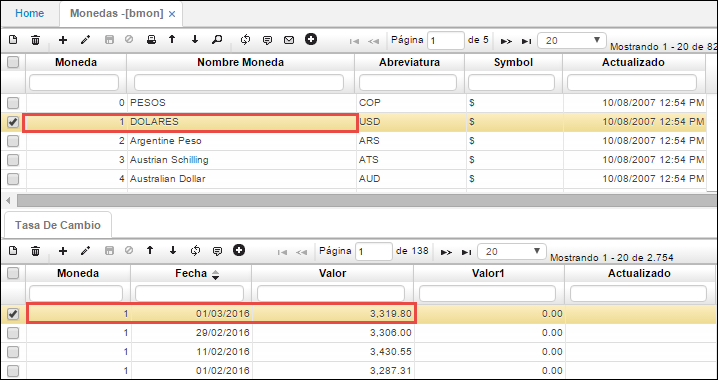

# Mmonedas - BMON

La aplicación **BMON** Monedas, permite registrar los diferentes tipos de monedas que se utilizarán en las operaciones de la empresa.  

**Moneda:** Consecutivo que asigna el sistema a las diferentes monedas que se registren. Este número será el que identifique a cada moneda en las diferentes aplicaciones que requieran especificar tipo de moneda.  
**Nombre moneda:** Nombre de la moneda que se registra.  
**Abreviatura:** Abreviatura asignada a la moneda registrada.  

En el detalle de la aplicación **BMON** llamado Tasa de Cambio, se registra el valor en pesos colombianos de la moneda seleccionada en el maestro.  

**Moneda:** Número de moneda correspondiente a la seleccionada en el maestro de la aplicación y de la cual se registrará la tasa de cambio.  
**Fecha:** Fecha en la cual se registra la tasa de cambio.  
**Valor:** Valor por el cual se efectúa la tasa de cambio.  

