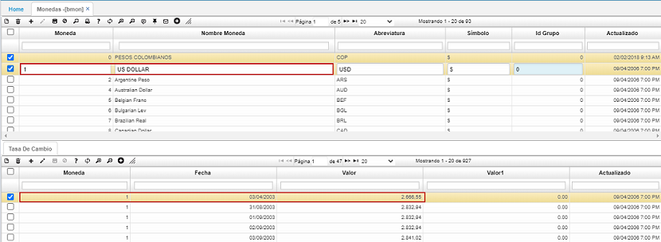

# Monedas - BMON  

En esta aplicación se puede ver la parametrización del proceso:  

* [Diferencia en cambio](http://docs.oasiscom.com/Operacion/common/bfinan/bmon#Diferencia-en-cambio)

La aplicación **BMON** Monedas, permite registrar los diferentes tipos de monedas que se utilizarán en las operaciones de la empresa.  

**Moneda:** Consecutivo que asigna el sistema a las diferentes monedas que se registren. Este número será el que identifique a cada moneda en las diferentes aplicaciones que requieran especificar tipo de moneda.  
**Nombre moneda:** Nombre de la moneda que se registra.  
**Abreviatura:** Abreviatura asignada a la moneda registrada.  

En el detalle de la aplicación **BMON** llamado Tasa de Cambio, se registra el valor en pesos colombianos de la moneda seleccionada en el maestro.  

**Moneda:** Número de moneda correspondiente a la seleccionada en el maestro de la aplicación y de la cual se registrará la tasa de cambio.  
**Fecha:** Fecha en la cual se registra la tasa de cambio.  
**Valor:** Valor por el cual se efectúa la tasa de cambio.  

  

##  [Diferencia en cambio](http://docs.oasiscom.com/Operacion/common/bfinan/bmon#Diferencia-en-cambio)  

Para realizar el proceso de Diferencia en cambio, primero se debe realizar el proceso de parametrización de la moneda desde esta aplicación **BMON**.  

Se selecciona el tipo de moneda, para el ejemplo de la ilustración, dólar.  

  

Luego, se va al detalle y se adiciona una nueva fila (+).  En el campo **_Moneda_** se diligencia el código correspondiente a la moneda, que para el caso de la ilustración es 1; en el campo **_Fecha_** se diligencia el último día del mes; en el campo **_Valor_**, se diligencia el valor en el que se encuentra el dólar(para este caso) en el mes y se guarda el registro. 

  

Posteriormente, se va a la aplicación [Diferencia en cambio - KPDC](http://docs.oasiscom.com/Operacion/erp/contabilidad/kproceso/kpdc) para continuar con el proceso.  

