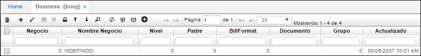

# Negocios - BNEG

Permite registrar los diferentes negocios por los que opera la compañía. Es decir, las diferentes líneas de negocio por las cuales la empresa factura y así reciben dinero.  

**Negocio:** Número que se desea asignar al nuevo negocio que se registra.  
**Nombre negocio:** Nombre del negocio a registrar.  

El campo nivel y padre se diligencian en caso tal que la empresa desee generar reportes de algunos negocios, los cuales se pueden desglosar por niveles teniendo asignado un padre.  

