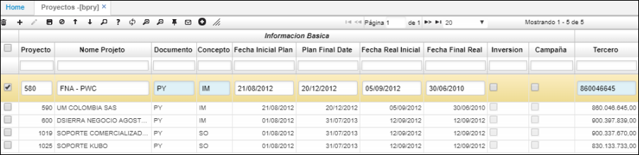
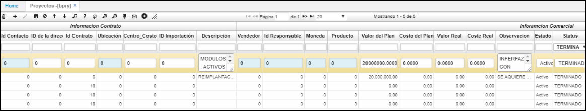

# BPRY - Proyectos

Permite registrar los diferentes proyectos en los que trabajará la empresa.  

**Proyecto:** Número que se le asignará al nuevo proyecto que se registra.  
**Nombre proyecto:** Nombre del nuevo proyecto que se registra.  
**Documento:** seleccionar del zoom el tipo de documento que genera el proyecto, ejemplo PY.  
**Concepto:** seleccionar del zoom el concepto por el cual se crea el proyecto, puede ser por implementación, soporte, desarrollo, entre otros.  
**Contrato:** Número de contrato del proyecto.  
**Ubicación:** Número de ubicación del proyecto, en caso tal que la empresa maneje varias empresas.  
**Centro costo:** Número de centro de costo dentro de la empresa al cual pertenece el proyecto que se ingresa.  
**Tercero:** Número de identificación de la empresa correspondiente al proyecto.  

**Contacto:** Número de teléfono del contacto en la empresa del proyecto.  
**ID de la dirección:** Dirección de la empresa del proyecto.  
**Fecha inicial plan:** Fecha inicial en la cual se planea iniciar el proyecto.  
**Fecha final plan:** Fecha final en la cual se planea finalizar el proyecto.  
**Fecha real inicial:** Fecha real en la cual se inicia el proyecto.  
**Fecha final real:** Fecha real en la cual se finaliza el proyecto.  
**Observación:** hacer una descripción de lo que se realizará en el proyecto.  
**Status:** Seleccionar el status en el que se encuentra el proyecto: _Activo, Planeado, Ejecutado, Congelado, Terminado._  
**Avance:** indicar el porcentaje de avance en el que se encuentra el proyecto.  
**Estado:** Los proyectos que se inactiven deben quedar bloqueados para realizar créditos (solicitudes); en el modulo de cartera, los créditos que ya están otorgados por dicho proyecto se mantiene el estado. Este aplica para facturas **FFAC**  y movimientos de tesoreria **TMOV.

