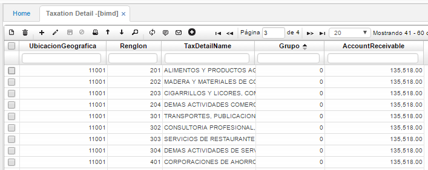

# Detalle Impuestos - BIMD

La aplicación **BIMD** permite ver el detalle de todos los impuestos registrados en la aplicación **BIMP**.

**Ubicación geográfica:** Si en **BIMP** se definió que el impuesto requiere ubicación geográfica, se diligencia el número de dicha ubicación geográfica.  
**Renglón:** Número de renglón en el detalle de la aplicación BIMP asignado a la tarifa relacionada con el impuesto registrado en el maestro de la aplicación **BIMP**.
**Nombre del impuesto:** Nombre de la tarifa relacionada al impuesto registrado en **BIMP**.  
**Grupo:** Número de grupo al cual pertenezca la tarifa del impuesto. Grupo previamente parametrizado en **BGRU**.

