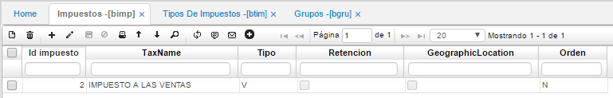
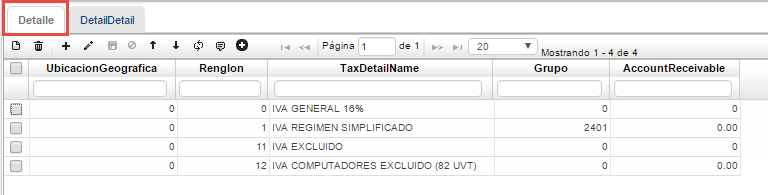
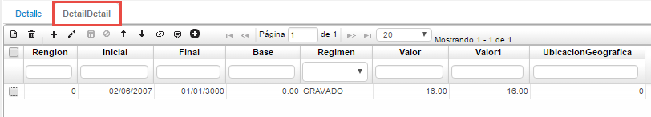
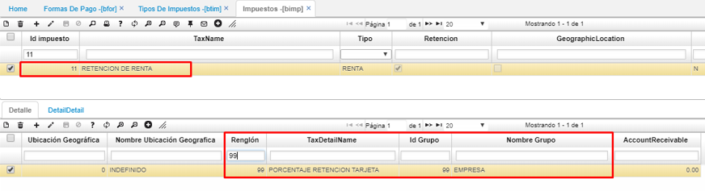
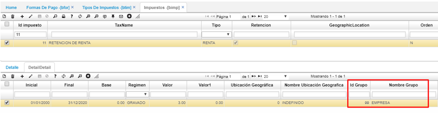

# Impuestos - BIMP

La aplicación **BIMP** permite parametrizar los impuestos con los cuales la empresa operará. Registrando en el maestro el nombre del impuesto, tipo, si aplica retención o si está ligado a alguna ubicación geográfica.  

**Id impuesto:** Consecutivo asignado automáticamente por el sistema.  
**Nombre impuesto:** Nombre del impuesto que se vaya a parametrizar.  
**Tipo:** Tipo de impuesto.  
**Retención:** Se marca el Check en caso que el impuesto siempre requiera retención, por ejemplo, impuesto a la Industria, Comercio y Avisos ICA.  
**Ubicación geográfica:** Se marca el Check en caso que el impuesto siempre deba estar ligado a una ubicación geográfica, por ejemplo, retención de ICA.  

En la parte del detalle, se registran las diferentes tarifas que posee el impuesto registrado en el maestro.  

**Ubicación geográfica:** Si se marcó el Check de Ubicación geográfica en el maestro, en este campo se escribe el número de ubicación geográfica que se debe relacionar con la tarifa.  
**Renglón:** Número de renglón que identifica a la tarifa del impuesto registrado dentro del sistema.  
**Nombre de la tarifa del impuesto:** Nombre de la tarifa relacionada al impuesto registrado en el maestro.  
**Grupo:** Número de grupo al cual pertenece la tarifa, grupo asignado previamente en la aplicación **BGRU** – Grupos.  

En la pestaña Detalle – Detalle se define la fecha inicial y final en la cual regirá la tarifa del impuesto, la base con la cual se calculará, el tipo de régimen, el valor porcentual de la tarifa del impuesto y la ubicación geográfica si se definió desde un comienzo en el maestro.  

**Renglón:** Número de renglón relacionado a la tarifa en la pestaña detalle.  
**Inicial:** Fecha inicial desde donde rige el impuesto.  
**Final:** Fecha final hasta cuando rige el impuesto.  
**Base:** Valor base sobre el cual se calcula el impuesto.  
**Régimen:** Régimen de la tarifa del impuesto: gravado, exento, excluido, fijo.  
**Valor:** Valor porcentual de la tarifa del impuesto.  
**Ubicación geográfica:** Número de la ubicación geográfica con la cual debe ir relacionada la tarifa del impuesto si aplica y si se definió en el maestro.  

### [Parametrización para las transferencias de dinero](http://docs.oasiscom.com/Operacion/common/bimpu/bimp#parametrización-para-las-transferencias-de-dinero)

En la parametrización realizada en la aplicación [**BTIM - Tipos de impuestos**](http://docs.oasiscom.com/Operacion/common/bimpu/btim#parametrización-para-las-transferencias-de-dinero), se asoció un renglón correspondiente al tipo de impuesto, explicaremos como crear el renglón en un impuesto, ejemplo, el impuesto número _11 - retención en la renta_, en el detalle se asocia un renglón 99 llamado _“Porcentaje retención tarjeta”_ y se asocia el grupo 99.  

En la pestaña _Detalle Detalle_ se parametriza el porcentaje (%) definido por el gobierno asociado al grupo 99 y en la fecha que corresponda.  

El proceso de transferencias de dinero se realiza por la aplicación [**TPTR - Transferencias**](http://docs.oasiscom.com/Operacion/erp/tesoreria/tproceso/tptr). _(Ver aplicación)_

