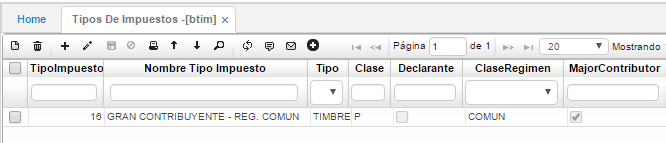
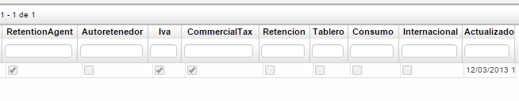
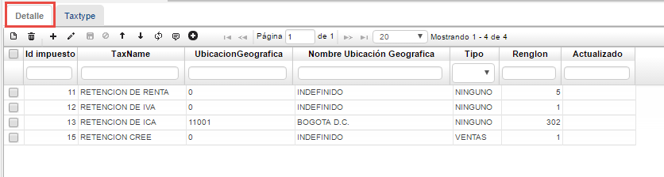

# Tipos de Impuestos - BTIM

La aplicación **BTIM** permite crear grupos de impuestos, los cuales serán aplicados al momento de realizar algún movimiento en donde requiera especificar el tipo de impuesto. Es decir, si vamos a crear una factura le indicamos el tipo de impuesto que parametrizamos para que este nos traiga el IVA, las retenciones, las autoretenciones, esto depende lo que se parametrice. Si le aplico un tipo de impuesto 2 a una factura y en ese tipo de impuesto parametrizo para que calcule IVA y retención CREE, al generar la factura estos impuestos se calcularán automáticamente.  

En el maestro indicamos el nombre que se le asignará al nuevo grupo de impuestos y se parametrizan otras características.  

**Tipo de impuesto:** Número asignado al nuevo grupo de impuestos.  
**Nombre tipo impuesto:** Nombre para el nuevo grupo de impuestos. En el ejemplo, se parametrizarán los impuestos que deben aplicarse cuando se realicen movimientos de un Gran contribuyente a un Régimen Común.  
**Tipo:** Se indica en la lista desplegable si el impuesto es de renta, ventas, comercio, timbre, consumo, CREE, ICA, contribución, AIU.  
**Clase:** Clase de impuesto: Privado (P), Comisiones (C).  
**Declarante:** Se marca el Check si es declarante.  
**Clase régimen:** Indicar si es régimen común o simplificado.  
**Gran contribuyente:** Se marca el Check si es gran contribuyente.  

**Agente retenedor:** Se marca el Check si es agente retenedor.  
**Auto retenedor:** Se marca el Check si es auto retenedor.  
**IVA:** Se marca el Check si requiere de IVA.  
**Impuesto comercial:** Se marca el Check si requiere impuesto comercial.  
**Retención:** Se marca el Check si realiza retención.  

En la parte del detalle se registrarán los impuestos que deberá aplicar el grupo creado.  

**Id impuesto:** Número del impuesto que se agrega al grupo, número de impuesto según la aplicación **BIMP**.  
**Nombre impuesto:** Nombre del impuesto según **BIMP**.  
**Ubicación geográfica:** Número de la ubicación geográfica si el impuesto lo requiere. Igualmente, según la parametrización que contenga en el **BIMP**.  
**Nombre ubicación geográfica:** Nombre de la ubicación geográfica relacionada con el impuesto.  
**Tipo:** Si el impuesto es por compras, ventas o ninguno.  
**Renglón:** número de renglón asignado en el detalle de la aplicación BIMP a la tarifa del impuesto que se relacionará en el grupo.  

