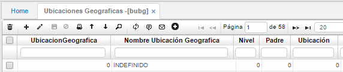

# Ubicaciones Geográficas - BUBG

Es la subdivisión interna de un país o zona Geográfica, lo cual nos permite llevar un control detallado de las diferentes ubicaciones.  

**Ubicación geográfica:** Número representativo del lugar geográfico.  
**Nombre ubicación geográfica:** Nombre del lugar geográfico.  
**Nivel/Padre:** Estos campos se diligencian de acuerdo a la tabla de códigos del DANE. Esta información está incluida en la base de datos en el momento que se implemente el software.  

