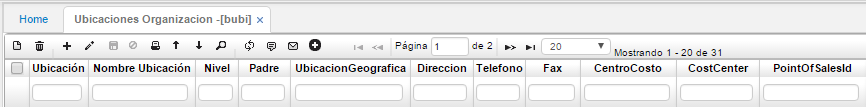
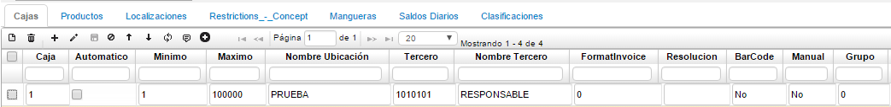
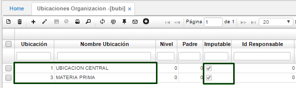
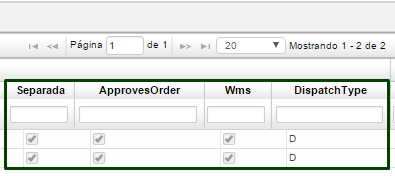
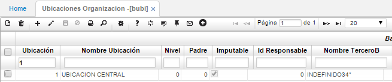
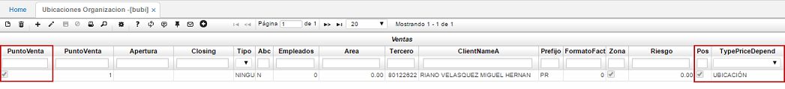
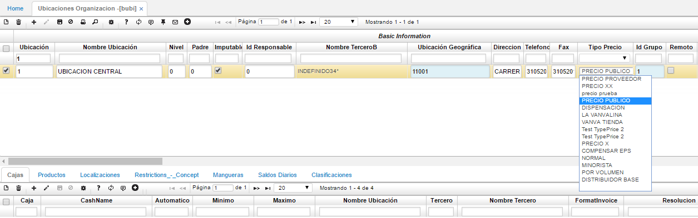

# Ubicaciones Organización - BUBI

Representa la división completa de las áreas o ubicaciones que conforman la empresa. Normalmente representa el organigrama existente.  

**Ubicación:** Número de ubicación que se desea asignar.  
**Nombre ubicación:** Nombre de la ubicación.  
**Nivel:** Número de nivel al que corresponde la ubicación a registrar de acuerdo a la ubicación padre.  
**Padre:** Número de la ubicación padre al que pertenece la ubicación a registrar.  
**Ubicación geográfica:** Número de la ubicación geográfica correspondiente, debidamente parametrizada en **BUBG**.  
**Dirección:** Dirección de la ubicación organizacional que se registra.  
**Teléfono:** Teléfono de la ubicación organizacional que se registra.  
**Centro costo:** Número de centro de costo que se le desea asignar a la ubicación organizacional.  
**Cost Center:** Se marca el Check para indicar que la ubicación organizacional utiliza el centro de costo asignado.  
**Responsable:** Número de identificación del responsable de la ubicación organizacional.  
**Grupo:** Si la ubicación organizacional pertenece a algún grupo que se haya parametrizado previamente en **BGRU**.  

La pestaña Cajas en el detalle, permite registrar las diferentes cajas que utiliza la ubicación organizacional registrada en el maestro.  

**Caja:** Número que identificará la caja que se registra.  
**Mínimo:** Valor mínimo para la caja.  
**Máximo:** Valor máximo permitido en la caja.  
**Nombre ubicación:** Nombre de la ubicación registrada en el maestro a la cual pertenece la caja.  
**Tercero:** Número de identificación del responsable de la caja.  
**Grupo:** Grupo al cual pertenece la caja según la ubicación organizacional registrada. Grupo parametrizado en **BGRU**.  

Esta aplicación perimite realizar parametrización para diferentes procesos del sistema OasisCom, cómo lo son los bancos para el módulo de tesorería, las cajas para el módulo de punto de venta, las bodegas para el proceso de producción entre otros. Por lo tanto, se realizará una explicación de esta aplicación para los procesos que interfieran con la misma y una general de la explicación de los campos.  

## Producción

Como se realiza la parametrización del producto es necesario parametrizar las bodegas correspondientes para el proceso de producción, en algunas empresas se tienen bodegas de materia prima y la planta de producción, por lo tanto, ingresaremos a la aplicación **BUBI** y diligenciamos nuestras bodegas, para esto debemos tener en cuenta lo siguiente:  

**Ubicación:** Id de la ubicación.  
**Nombre de la ubicación:** Por ejemplo, Bodega materia prima.  
**Imputable:** El flag se debe activar  

Si requerimos reservar o separar insumos para un proceso de producción con el fin que no se utilicen en algún otro proceso y tengamos asegurados esos insumos cuando vayamos a realizar el proceso, debemos tener en cuenta que en el **BUBI** en las ubicaciones que hemos parametrizado anteriormente debemos diligenciar lo siguiente:

**Separada:** Activar el flag.  
**ApprovesOrder:** Activar el flag.  
**WMS:** Activar el flag.  
**DispatchType:** Se debe diligenciar la letra D.  

## Parametrización Tipo de Precio

En la aplicación **BUBI** se debe tener en cuenta que para la ubicación seleccionada, si los campos _Punto de Venta_ y _Pos_ estan activos y el campo _TypePriceDepend_ tiene seleccionada la opción **UBICACIÓN**, retornará el tipo de precio parametrizado en esta aplicación (BUBI) en las aplicaciones GFAC, JFAC y JVEN.  

En este caso se tendrá en cuenta el campo _Ubicación_ con filtro 1.  

Campos _Punto de Vebnta, Pos, TypePriceDepend_.

Seguidamente, en el campo _Tipo de Precio_ seleccionaremos de la lista desplegable la opción correspendiente según el caso.  

Definido el Tipo de Precio, continuaremos a verificar dicha parametrización en cualquiera de las aplicaciones nombradas anteriormente GFAC, JFAC y JVEN. Para este ejemplo consultaremos la aplicación [**GFAC - Facturas**](http://docs.oasiscom.com/Operacion/is/hospital/gfacturacion/gfac).  

