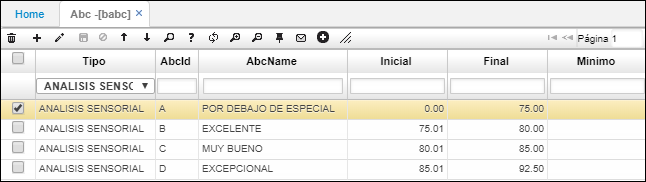

# BABC - ABC

Para el proceso de análisis de calidad se debe realizar previamente cierta parametrización, entre ella está la aplicación **BABC - Abc** en la cual se definirán los tipos de análisis sensorial, los cuales corresponden a rangos configurados según la necesidad.  

**Tipo:** se debe seleccionar de la lista la opción _Análisis Sensorial_.  
**Abc Id:** se ingresa el Id del registro, este corresponde a una letra.  
**Abc Name:** se ingresa el nombre del registro.  
**Inicial y Final:** se ingresan los rangos mínimos y máximos según la necesidad.  

