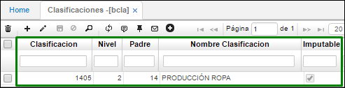
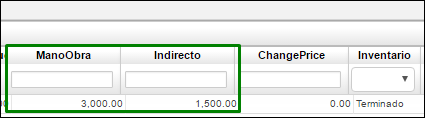

# CLASIFICACIONES - BCLA

Esta aplicación permite hacerle una clasificación al producto de acuerdo con las necesidades del cliente.

## Producción

Iniciamos con la parametrización de la clasificación del producto, esto se realiza en la aplicación **BCLA**, estas clasificaciones son de acuerdo a las necesidades del cliente y se deben parametrizar antes del producto. Los productos terminados deben tener una clasificación diferente de 0 para diligenciar los costos estándar del proceso de producción.  

Adicionamos un registro nuevo, indicamos el id de la clasificación, el nivel y padre de la misma, el nombre, activamos el flag en el campo imputable, en el campo mano de obra vamos a registrar el costo estándar de la mano de obra que se utilizará o que se gastará a nivel de dinero para producir una unidad de la camisa sencilla, por último, en el campo Indirecto registraremos el costo estándar de los costos indirectos de fabricación (CIF) que se gastarán al realizar una unidad de la camisa sencilla.  

