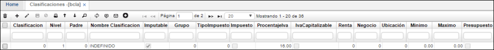

# CLASIFICACIONES - BCLA

En esta aplicación se clasifican los productos o servicios de acuerdo a nuestras necesidades. Por ejemplo, si es una empresa de alimentos puede ser: Lácteos, cereales, granos, frutas, entre otros.  

**Clasificación:** Consecutivo automático que arroja el sistema.  
**Nombre clasificación:** Especificar el nombre de la clasificación definida.  

Los campos de grupo y tipo de impuesto como lo hemos visto anteriormente nos definen las clasificaciones tributarias.  

Esta aplicación perimite realizar parametrización para diferentes procesos del sistema OasisCom, cómo lo son clasificaciones de productos terminados, materia prima, de activos fijos entre otros. Por lo tanto, se realizará una explicación de esta aplicación para los procesos que interfieran con la misma y una general de la explicación de los campos.

## Producción

Iniciamos con la parametrización de la clasificación del producto, esto se realiza en la aplicación **BCLA**, estas clasificaciones son de acuerdo a las necesidades del cliente y se deben parametrizar antes del producto. Los productos terminados deben tener una clasificación diferente de 0 para diligenciar los costos estándar del proceso de producción.  

Adicionamos un registro nuevo, indicamos el id de la clasificación, el nivel y padre de la misma, el nombre, activamos el flag en el campo imputable, en el campo mano de obra vamos a registrar el costo estándar de la mano de obra que se utilizará o que se gastará a nivel de dinero para producir una unidad de la camisa sencilla, por último, en el campo Indirecto registraremos el costo estándar de los costos indirectos de fabricación (CIF) que se gastarán al realizar una unidad de la camisa sencilla.  

