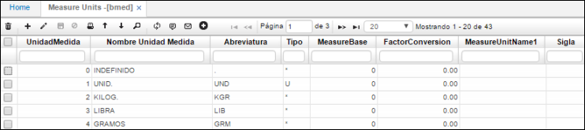

# Unidad de Medida - BMED

En esta aplicación parametrizamos todas las unidades de medida que podemos tener en nuestros productos, por ejemplo, Kilo, Litro, gramo, unidad, entre otros.  

**Unidad de medida:** Consecutivo automático que arroja el sistema.  
**Nombre unidad de medida:** especificar el nombre de la unidad de medida.  
**Abreviatura:** Indicar la abreviatura de la unidad de medida por ejemplo GR para gramos, MTR para metros, CAJ para caja, entre otros.  

