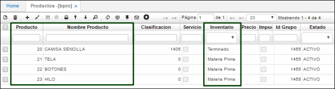
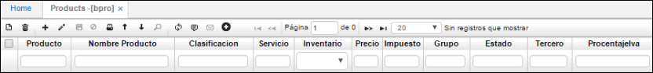
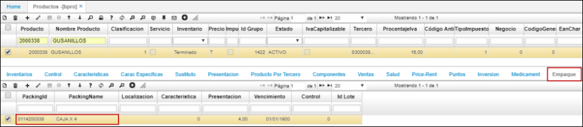
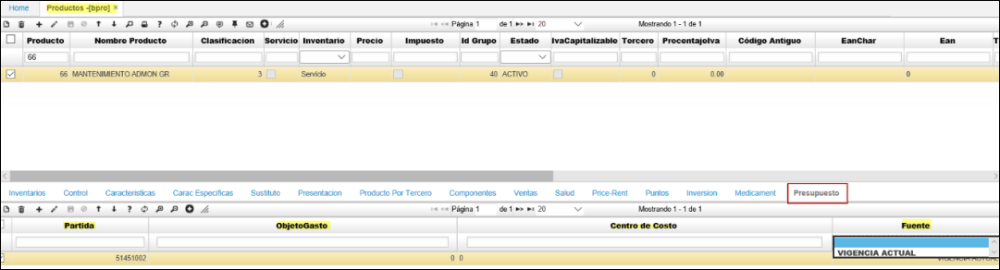
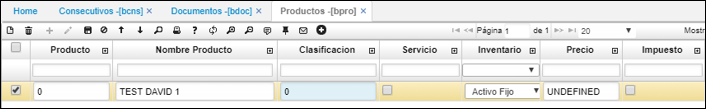
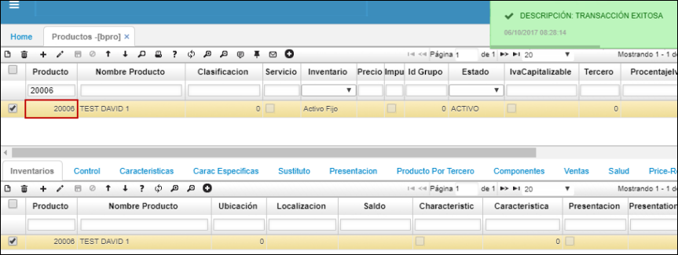
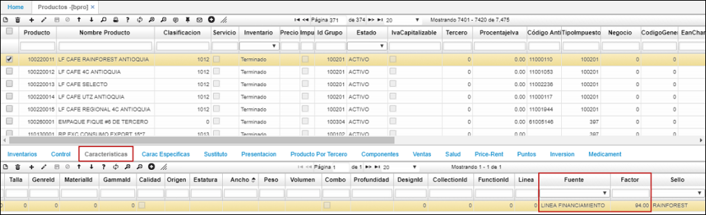
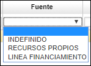
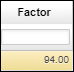
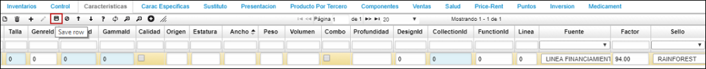

# PRODUCTOS - BPRO

En esta aplicación se deben parametrizar todos los productos o servicios que ofrece nuestra organización con sus respectivas características.  

**Producto:** Consecutivo automático que arroja el sistema.  
**Nombre del producto:** Se debe registrar el nombre del producto de acuerdo a nuestro portafolio.  
**Clasificación:** Se debe indicar el Id de la clasificación previamente parametrizada en BCLA, esta clasificación la define la empresa.  
**Servicio:** Se debe activar el Check box en caso de ofrecer un servicio.  
**Inventario:** Se debe especificar si es un servicio, materia prima, producto en proceso, un suministro, producto terminado, activo fijo, entre otros.  
**Impuesto:** Se debe activar el Check box en caso que al producto se le deba aplicar impuestos.  
**Grupo:** Id del grupo previamente parametrizado en la aplicación **BGRU**.  
**Estado:** Debemos registrar si el producto está activo o inactivo.  
**Porcentaje IVA:** Se debe indicar el porcentaje de IVA en número entero, por ejemplo 16.  

**Tipo de impuesto:** Id del tipo de impuesto que le aplica al producto previamente parametrizado en **BTIM**, esto permite calcular los impuestos parametrizados a ese producto.  
**EAN:** Se debe especificar el número EAN del producto para que se pueda diligenciar automáticamente el producto con un lector.  
**Marca:** Registrar el Id de la marca que aplica al producto y esta previamente parametrizada en **BMAR**.  
**Línea:** Registrar el Id de la línea que aplica el producto y esta previamente parametrizada en **BLIN**.  
**Unidad de medida:** El Id de la unidad de medida del producto parametrizada en **BMED**.  
**Ingreso:** Registrar la fecha de ingreso del producto.  

Esta aplicación nos permite realizar la parametrización de todos los servicios y/o productos (materia prima, suministro, terminados, activos fijos) con sus respectivas características, por lo tanto, se explicara los procesos que interfieren con dicha aplicación y una explicación general.  

### [Pestaña Empaque](http://docs.oasiscom.com/Operacion/common/bprodu/bpro#pestaña-empaque)

La pestaña _Empaque_ en la aplicación BPRO permite tener el registro de cada código de barras (EAN) que represente una unidad de empaque. Esta parametrización será el insumo de validación para el proceso de picking en el WMS.  

###Pestaña Presupuesto  
Se crea esta pestaña la cual permitirá relacionar a cada producto, en la compra la afectación presupuestal.  
Debe de documentar los campos: Partida, Objeto Gasto, Centro de Costo, Fuente.

## [Producción](http://docs.oasiscom.com/Operacion/common/bprodu/bpro#producción)

Continuamos con la parametrización del producto, esta se realiza en la aplicación **BPRO** en donde se indica el nombre del producto y el tipo de éste, por ejemplo, si es un producto terminado, en proceso o materia prima. Por ejemplo, si se obtiene un insumo que requerimos para obtener un producto terminado debemos indicar en el campo _inventario “Materia Prima”_. Para esto ingresamos inicialmente a **BPRO** y realizamos la parametrización correspondiente al producto terminado (camisa) y sus respectivos insumos (tela, botones, hilo), en esta aplicación se diligencian todas las características de los productos cómo lo son la unidad de medida, clasificación, marca, línea, entre otros.  

## [Secuencia de Consecutivos](http://docs.oasiscom.com/Operacion/common/bprodu/bpro#secuencia-de-consecutivos)

Realizada la parametrización previa en las aplicaciones [**BCNS - Consecutivos**](http://docs.oasiscom.com/Operacion/common/bsistema/bcns#secuencia-de-consecutivos) y [**BDOC - Documentos**](http://docs.oasiscom.com/Operacion/common/bsistema/bdoc#secuencia-de-consecutivos), la aplicación correspondiente al documento a generar, en este caso **BPRO** asignará automáticamente el consecutivo al registro.  

Al crear un documento y dar click en _Guardar_ el sistema asignará el consecutivo.  

## [Parametrización Proceso Compra de Café](http://docs.oasiscom.com/Operacion/common/bprodu/bpro#parametrización-proceso-compra-de-café)

Para realizar el proceso de compra de café es necesario tener en cuenta la parametrización de los campos _Fuente_ y _Factor_ ubicados en la pestaña _Características_ de la aplicación **BPRO**.  

Registrado el producto en el maestro de la aplicación, nos dirigimos al detalle en la pestaña _Caracteristicas_, allí encontraremos el campo **_Fuente_** en el cual seleccionaremos la opción por la cual se adquirirá el café, ya sea por recursos propios de la cooperativa o por una línea de financiamiento que puede ser otorgada por la Federación Nacional de Cafeteros.  

En el campo **_Factor_**, indicaremos el número de factor de calidad establecido y vigente  en ese momento.  

Finalmente, damos click en el botón  de la barra de herramientas del detalle para guardar la información en los campos editados.  

A continuación, se deberá parametrizar la aplicación [**BCCL - Calidades**](http://docs.oasiscom.com/Operacion/common/bcomer/bccl) para poder realizar el proceso de compra de café. (_Ver aplicación_) 
