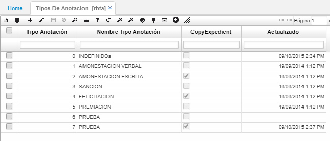
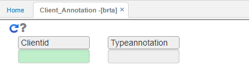
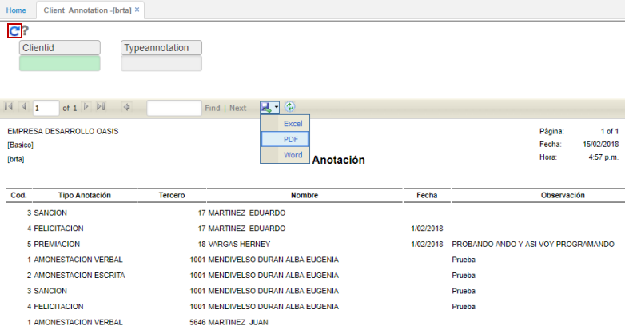
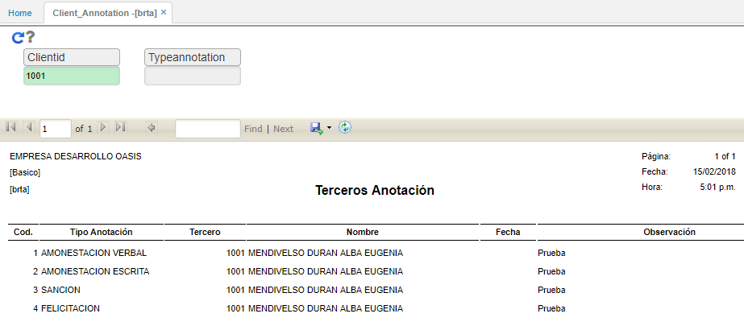

# BRTA - Anotaciones por Tercero

El reporte BRTA permite ver las anotaciones (sanciones, observaciones, premiaciones, felicitaciones, etc) por tercero en específico o todos en general.  

Los tipos de anotaciones se deben parametrizar previamente en la aplicación RBTA - tipos de Anotación, allí se indicará si se realiza copia al expediente del tercero.  

Se deseamos consultar todas las anotaciones que se le han hecho a todos los empleados en general, ingresamos a la opción BRTA y damos click en el botón 

El sistema arrojará un reporte con todas las anotaciones de los empleados. Este reporte puede ser extraíble en formato Excel, PDF o Word.  

Consultaremos las anotaciones realizadas a un tercero en específico.  

