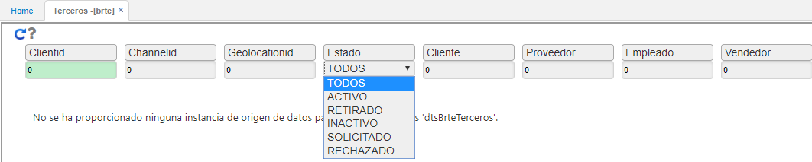
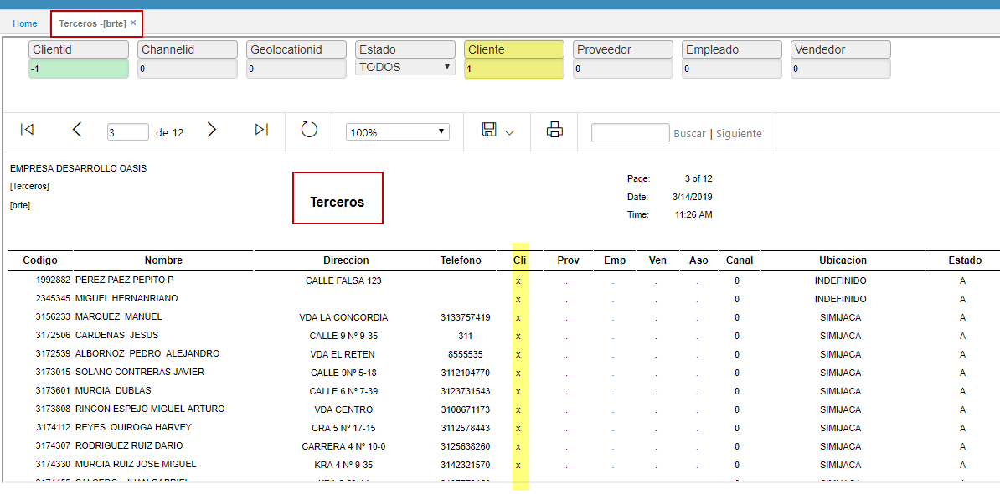

---
layout: default
title: Terceros
permalink: /Operacion/common/brepor/brte
editable: si
---

# BRTE - Terceros

Reporte **BRTE** permite visualizar los terceros que estan parametrizados en el basico de terceros **BTER** que sean tipo:
* Cliente.  
* Proveedor.  
* Empleado.  
* Vendedor.  



Para el caso donde se desea realizar la consulta de todos los terceros el filtro en el campo ClientId es -1 ; ya que tercero cero se crea por defecto y si existe.
Para el ejemplo que se ilustra filtraremos el campo Cliente en -1






