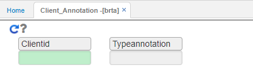
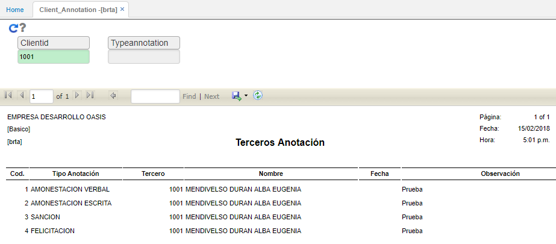

# BRTE - Terceros

Reporte **BRTE** permite visualizar los terceros que estan parametrizados en el basico de terceros **BTER**

Se deseamos consultar todas las anotaciones que se le han hecho a todos los empleados en general, ingresamos a la opción BRTA y damos click en el botón 

El sistema arrojará un reporte con todas las anotaciones de los empleados. Este reporte puede ser extraíble en formato Excel, PDF o Word.  

Consultaremos las anotaciones realizadas a un tercero en específico.  

