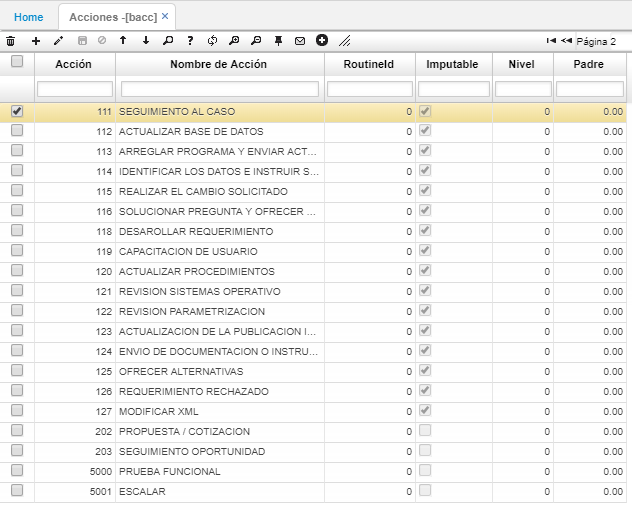

# BACC - Acciones

En esta opción se parametrizan las acciones o medidas a tomar por cada posible causa de una falla y/o defecto.  

En los campos **Acción** y **Nombre de Acción** se deben ingresar el id y el nombre de la acción respectivamente.  

