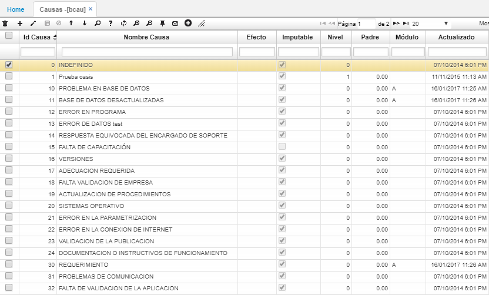

# BCAU - Causas

En esta opción se parametrizan las posibles causas de las fallas y/o defectos parametrizados previamente en la opción [**BFAL - Fallas**](http://docs.oasiscom.com/Operacion/common/bservi/bfal).  

En los campos **Id Causa** y **Nombre Causa** se deben ingresar el id y el nombre de la causa respectivamente.  

