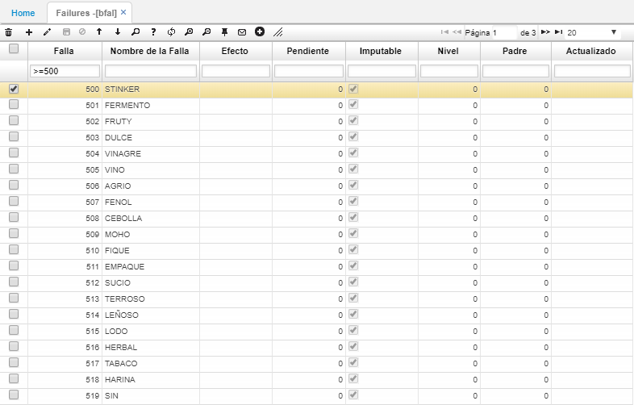

# BFAL - Fallas

En esta opción deben ser parametrizadas las fallas o defectos a utilizar para el registro del análisis de calidad. Deben ser utilizadas desde la falla 500 hasta la falla 549.  

**Falla** y **Nombre de la Falla:** se debe ingresar el id y el nombre de la falla respectivamente.  

