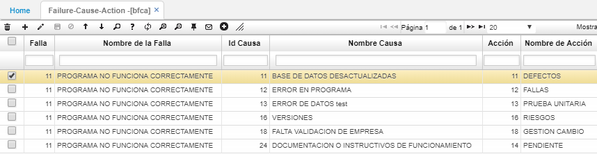

# BFCA - Fallas - Causa - Acción

En esta opción según los defectos pertinentes ingresados a [**BFAL - Fallas**](http://docs.oasiscom.com/Operacion/common/bservi/bfal) (500-549) se relacionan las posibles causas previamente configuradas en la opción [**BCAU - Causas**](http://docs.oasiscom.com/Operacion/common/bservi/bcau) y las acciones por cada causa previamente configuradas en la opción [**BACC - Acciones**](http://docs.oasiscom.com/Operacion/common/bservi/bacc).  

**Falla** y **Nombre de la Falla:** se ingresa el id y el nombre de la falla correspondiente.  
**Id Causa** y **Nombre Causa:** se asocia la causa del defecto o falla previamente ingresado.  
**Acción** y **Nombre de Acción:** se asocia(n) la(s) acción(es) a tomar para el defecto o falla previamente ingresado.  

