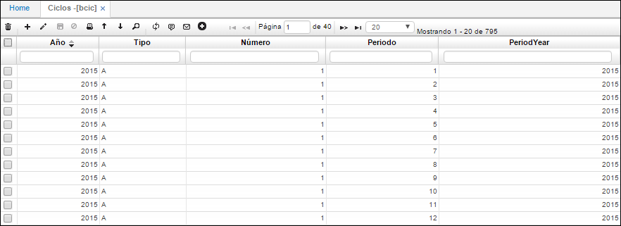
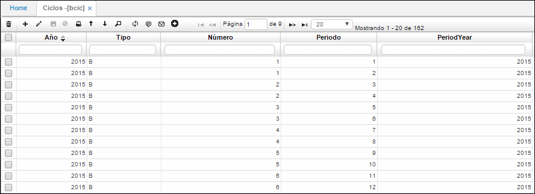

# Ciclos - BCIC

En la aplicación **BCIC** se registran los periodos o lapsos de una operación dentro de la compañía: Mensual, Bimestral, Trimestral, Semestral, Anual.  

**Año:** Año del ciclo que se registra.  
**Tipo:** Tipo de ciclo que se registra: Mensual (M), Bimestral (B), Trimestral (T), Semestral (S), Anual (A).  
**Número:** Número del ciclo que se registra; si el ciclo que se desea registrar es anual, en número de ciclo será 1 puesto que es solo un ciclo anual, si los ciclos son bimestrales, entonces en el campo número se repetirá de acuerdo al número de periodos que contenga ese ciclo, en este caso el ciclo es bimestral como se muestra en el ejemplo:  

**Periodo:** Corresponde al número asignado a cada mes del año.