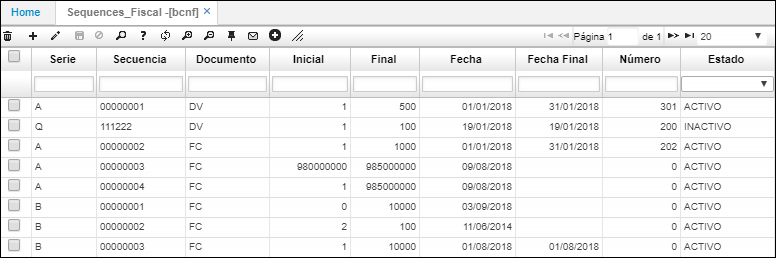

# BCNF - Secuencias Fiscales

La aplicación **BCNF** permite administrar los consecutivos de documentos fiscales.  

Agregamos un nuevo registro y diligenciamos los campos, asignando la serie, número de secuencia del documento fiscal, siglas del documento fiscal, los documentos son parametrizables en la opción [**BDOC - Documentos**](http://docs.oasiscom.com/Operacion/common/bsistema/bdoc), indicar en los campos _Inicial y Final_ la capacidad para crear documentos fiscales, fecha final y número desde donde inicia el consecutivo.  

Ingresados los datos damos click en el botón _Guardar_.  

