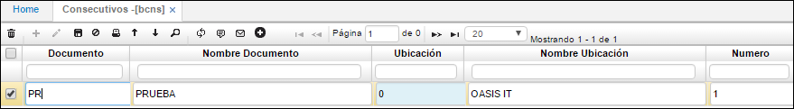

# Consecutivos - BCNS

Se define el número en el cual se encuentra el consecutivo de cada uno de los documentos parametrizados en **BDOC**. Sirve para definir el consecutivo inicial o hacer alguna actualización que desee el usuario sobre los consecutivos, esta se va actualizando automáticamente a medida que se inserte un nuevo documento de los definidos en la opción documentos. En caso que en el documento se haya definido que maneja varias ubicaciones o maneja niveles, entonces la pantalla nos permitirá definir a que ubicación se está haciendo referencia con el consecutivo, en caso contrario la oficina siempre va a aparecer en cero (0) y el sistema no dejará parar en este sitio.  

**Documento:** Siglas del documento previamente parametrizado en **BDOC**.  
**Nombre documento:** Nombre del documento al cual se parametrizará el consecutivo, no es necesario diligenciarlo, al dar TAB en el documento este se diligencia automáticamente.  
**Ubicación:** Número de ubicación al cual está asociado el documento.  
**Nombre ubicación:** Nombre de la ubicación la cual está asociada el documento. Igualmente, ese campo no es necesario diligenciarlo, al dar TAB este campo se diligencia automáticamente.  
**Número:** Número desde el cual se desea que inicie el consecutivo para el documento. Cuando se suben archivos por plano, es decir que se importan al sistema desde un archivo en Excel y posteriormente se va a realizar un documento desde el sistema es necesario revisar el consecutivo.  

