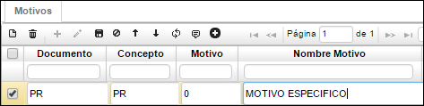
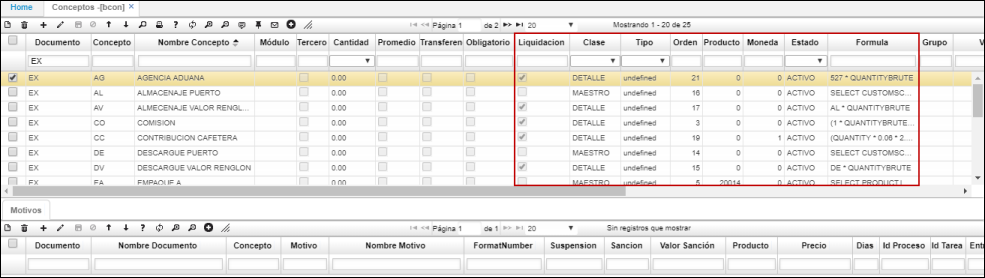

## Conceptos - BCON

La aplicación Conceptos permite registrar los conceptos por los cuales se generan los distintos documentos que la compañía maneja, estos previamente parametrizados en **BDOC**.  

**Documento:** Siglas asignadas en BDOC al documento con el cual se relacionará el concepto.  
**Concepto:** Siglas del concepto con el cual se relacionará el documento.  
**Nombre concepto:** Nombre del concepto con el cual se relacionará el documento.  
**Módulo:** Abreviatura del módulo al cual afecta el concepto.  
**Cliente:** Se marca el Check cuando el concepto está relacionado estrictamente al cliente al cual se le generará el documento.  
**Cantidad:** Especifica la afectación del concepto en el módulo especificado anteriormente, ya sea sumando, restando o si no realiza afectación alguna.  
**Contabilidad:** Indicar la contabilidad que afectará el concepto, si afecta el libro local escribir L, si afecta la contabilidad **IFRS** escribir I.  

En la pestaña Motivos en el detalle, se asignan los distintos motivos por los cuales se pueden generar los documentos de acuerdo al concepto. Si el motivo es general para todos los documentos, se crea un motivo 0 el cual los identificará a todos, pero por si el contrario el concepto necesita hacer referencia a varios motivos por el cual se genera el documento se registran los que se crean convenientes. Esta parametrización también se puede realizar directamente desde la aplicación **BMOT**.  

**Documento:** documento con el cual se relaciona el concepto y por tal el motivo.  
**Concepto:** concepto registrado en el maestro al cual se le definirán los motivos.  
**Motivo:** número del motivo que será asignado al concepto. Motivo previamente parametrizado en **BMOT**.  
**Nombre motivo:** nombre asignado al motivo en **BMOT**.  

# [Liquidación de Exportaciones](http://docs.oasiscom.com/Operacion/common/bsistema/bcon#liquidación-de-exportaciones)

Para realizar la liquidación de una exportación, se debe tener en cuenta la parametrización realizada en la aplicación BCON en los campos _Liquidación, Clase, Orden, Producto, Moneda, Estado_ y _Fórmula_.  

**Liquidación:** al activar el check, indicará que el concepto se utiliza en la liquidación final del costo de la exportación.  
**Clase:** indica que el concepto se liquida a nivel de maestro o detalle de la exportación.  
**Orden:** indica la secuencia lógica de cálculo de los conceptos a liquidar.  
**Producto:** indica el código de producto a evaluar en una posible formulación.  
**Moneda:** indica la moneda origen del concepto a evaluar.  
**Estado:** indica el estado del concepto de liquidación.  
**Fórmula:** en este campo se ingresará la fórmula a evaluar en el concepto.  

