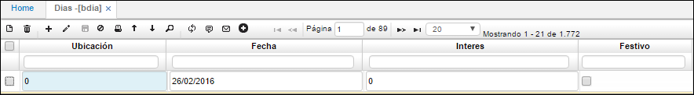

# Días - BDIA

En la aplicación **BDIA** se registran todos los días del año. Permite registrar varios años. En esta aplicación también se pueden relacionar los días festivos del año, activando el Check box de festivo o si no se pueden parametrizar en la aplicación **BFES**.  

**Ubicación:** Número de ubicación de la empresa donde se desean registrar los días.  
**Fecha:** Fecha del día a registrar.  

