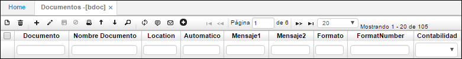
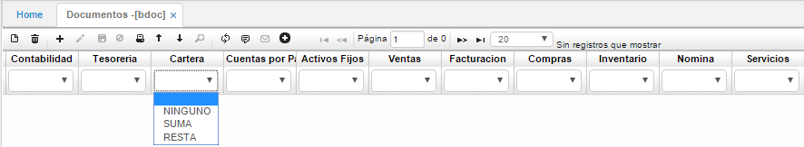
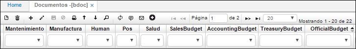
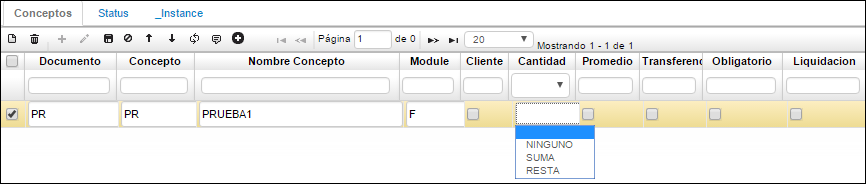
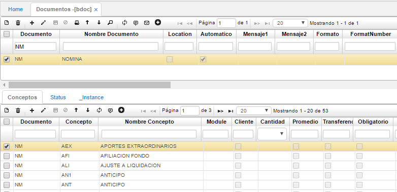
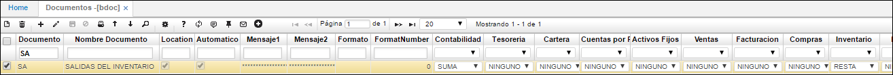
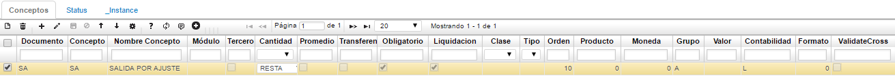
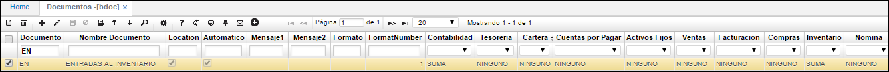
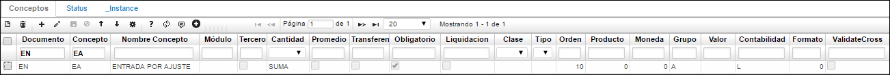
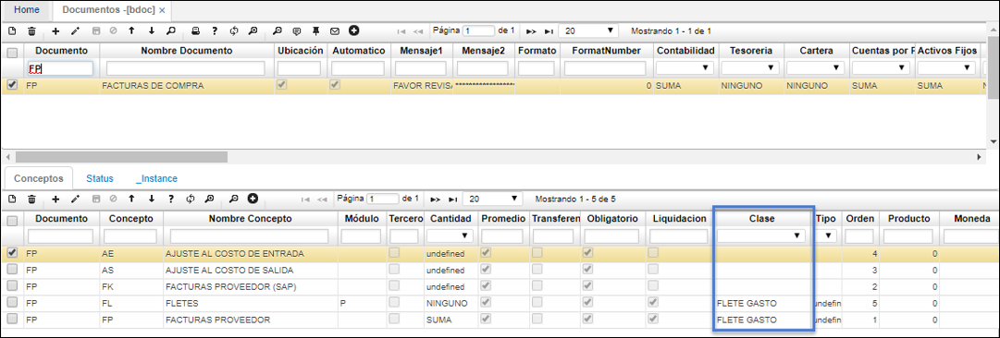

## BDOC - Documentos

Todo el sistema y los módulos basan su operación en una serie de documentos que facilitan la operación y con los cuales se realiza el control de cada uno de los pasos que se llevan a cabo en el sistema. Estos documentos son definidos al iniciar el sistema y no se pueden eliminar ni actualizar. Se debe tener en cuenta los siguientes tips.  

En cuanto a los consecutivos se debe tener presente que el check box del campo _automático_ si lo prendo todos mis documentos quedan con consecutivo automático, en caso de no prenderlo o activarlo debemos entrar a diligencias los consecutivos a la hora de realizar un documento. Si el Check box del campo _ubicación_ lo dejo activo, cada ubicación me va a manejar consecutivo por ubicación.  

Igualmente se debe tener presente que se debe parametrizar a cada consecutivo con el módulo que va a trabajar como lo veremos en la aplicación **BCON** y su respectivo motivo como se verá en la aplicación **BMOT**.  

**Documento:** Siglas que se le asignarán al documento a registrar, ejemplo si es una cuenta por pagar CP, una nota contable NK, un recibo de caja RC entre otros. Es importante tener en cuenta que la mayoría de estos documentos ya se encuentran parametrizados.  
**Nombre documento:** Nombre del documento, ejemplo para CP se diligencia cuenta por pagar.  
**Ubicación:** Se activa el Check si el documento está amarrado a la ubicación como lo mencionamos anteriormente.  
**Mensaje 1 y 2:** Permite escribir el mensaje que se desea mostrar al momento de visualizar la vista previa del documento.  
**Número formato:** Número del formato parametrizado para la generación del documento, formato de impresión.  
**Programa:** Programa en el cual se generará el documento. Por ejemplo: si es un CP debe diligenciarse el módulo **PMOV** que es donde yo voy a registrar todas las CP.  

En los siguientes campos, desde _contabilidad_ hasta _presupuesto oficial_ se debe parametrizar si el documento que se registra afectará algún módulo, ya sea sumando o restando, en caso de que no afecte seleccionar “Ninguno”.  

Se debe verificar que el registro se encuentre en estado Activo.  

En la pestaña Conceptos del detalle, se parametrizan los conceptos por los cuales se pueden generar documentos de acuerdo al registrado en el maestro. Por cada documento se pueden parametrizar varios conceptos. Tener en cuenta que para parametrizar el Concepto se puede hacer desde el detalle del BDOC o directamente desde la aplicación BCON como lo mostraremos más adelante.  

**Documento:** siglas del documento registrado en el maestro.  
**Concepto:** concepto por el cual se genera el documento, debidamente parametrizado en **BCON** - Conceptos.  
**Nombre concepto:** el sistema automáticamente muestra el nombre del concepto.
**Modulo:** módulo al que afecta el concepto.  
**Cantidad:** Seleccionar si el concepto suma, resta o no realiza ninguna afectación al módulo relacionado.  
**Moneda:** tipo de moneda que maneja el concepto.  
**Grupo:** grupo al cual está relacionado el concepto.  
**Contabilidad:** indicar la contabilidad que afectará el concepto, si afecta el libro local escribir L, si afecta la contabilidad IFRS escribir I.  

Esta opción permite parametrizar los códigos los cuales indicarán el concepto por el cual se debe cargar la cuenta afectada, si a un gasto administrativo, gasto por ventas, si es una cuenta por pagar, de provisión, entre otras.  

En el maestro indicamos el documento al cual se le van a parametrizar los códigos y en el detalle, agregamos una fila por cada código que se desee relacionar con el documento. Tal como se muestra en la imagen.  

## Inventario Periódico

Para realizar el inventario periódico, es necesario parametrizar en la aplicación BDOC los documentos SA - Salidas del Inventario y EN - Entradas al Inventario. 

**SA - Salidas del Inventario**

Al parametrizar el documento SA, se deberá agregar en el detalle el concepto SA - Salida por Ajuste. En el maestro de la aplicación se agregará un nuevo registro y se diligenciarán los siguientes campos.  

**Documento:** digitar SA.  
**Nombre documento:** asignar el nombre al documento, es decir, Salidas del Inventario.  
**Location:** activar el flag.  
**Automático:** activar el flag.  
**Contabilidad:** indicar en el campo _Contabilidad_ la opción **Suma**.  
**Inventario:** indicar en el campo _Inventario_ la opción **Resta**.  
A los demás campos se les asignará la opción **Ninguno**.   
**Programa:** digitar el programa _imov_.  
**Orden:** ingresar el número 2.  
**Módulo:** ingresar la letra **I** correspondiente al módulo de inventarios.  

Ingresados los datos, damos click en el botón _Guardar_ ubicado en la barra de herramientas del maestro y nos dirigimos al detalle de la aplicación.  

En la pestaña _Conceptos_ del detalle, se parametrizará el concepto SA - Salida por Ajuste, se agrega un nuevo renglón y se ingresan los siguientes campos.  

**Documento:** ingresar documento SA.  
**Concepto:** ingresar concepto SA.  
**Nombre de concepto:** el nombre del concepto será _Salida por Ajuste_.  
**Cantidad:** seleccionar la opción _Resta_.  
**Obligatorio:** activar el flag.  
**Liquidación:** activar el flag.  
**Orden:** ingresar el número 10.  
**Grupo:** grupo A.  
**Contabilidad:** ingresar la letra L referente al libro local.  

Diligenciados los campos anteriores, damos click en el botón _Guardar_ ubicado en la barra de herramientas del detalle.  

**EN - Entradas al Inventario**

Al parametrizar el documento EN, se deberá agregar en el detalle el concepto EA - Salida por Ajuste. En el maestro de la aplicación se agregará un nuevo registro y se diligenciarán los siguientes campos.  

**Documento:** digitar EN.  
**Nombre documento:** asignar el nombre al documento, es decir, Entradas al Inventario.  
**Location:** activar el flag.  
**Automático:** activar el flag.  
**Contabilidad:** indicar en el campo _Contabilidad_ la opción **Suma**.  
**Inventario:** indicar en el campo _Inventario_ la opción **Suma**.  
A los demás campos se les asignará la opción **Ninguno**.   
**Programa:** digitar el programa _imov_.  
**Orden:** ingresar el número 1.  
**Módulo:** ingresar la letra **I** correspondiente al módulo de Inventarios.  

Ingresados los datos, damos click en el botón _Guardar_ ubicado en la barra de herramientas del maestro y nos dirigimos al detalle de la aplicación.  

En la pestaña _Conceptos_ del detalle, se parametrizará el concepto EA - Entrada por Ajuste, se agrega un nuevo renglón y se ingresan los siguientes campos.  

**Documento:** ingresar documento EN.  
**Concepto:** ingresar concepto EA.  
**Nombre de concepto:** el nombre del concepto será _Entrada por Ajuste_.  
**Cantidad:** seleccionar la opción _Suma_.  
**Obligatorio:** activar el flag.  
**Orden:** ingresar el número 10.  
**Grupo:** grupo A.  
**Contabilidad:** ingresar la letra L referente al libro local.  

Dejar los demás campos vacios o en 0 según corresponda.  

Diligenciados los campos anteriores, damos click en el botón _Guardar_ ubicado en la barra de herramientas del detalle.  

Finalmente, han sido parametrizados en BDOC los documentos SA y EN con su respetivo concepto. Para continuar con la ejecución del inventario periódico, ingresaremos a la aplicación [**IFPI - Prepara Inventario Diario**](https://github.com/OasisCom/Docs/blob/master/Operacion/scm/inventarios/ifisico/ifpi.md).  

## [Parametrización de Fletes](http://docs.oasiscom.com/Operacion/common/bsistema/bdoc#parametrización-de-fletes)

Para calcular el flete, se debe configurar inicialmente el documento de la factura de compra desde la opción **BDOC** y en el campo _Clase_ se debe seleccionar el flete a calcular.  

Seguidamente, ingresaremos a la aplicación [**OFAC - Facturas de Compra**]

