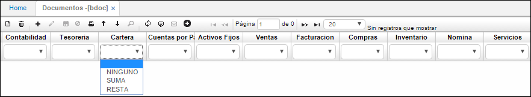
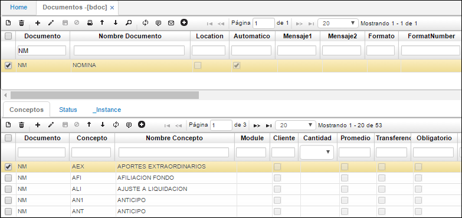
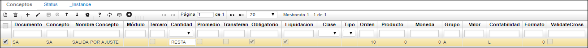
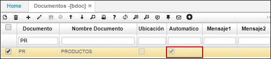

---
layout: default
title: Documentos
permalink: /Operacion/common/bsistema/bdoc
editable: si
---

# BDOC - Documentos

**Menú**

1. [**BDOC Documentos**](http://docs.oasiscom.com/Operacion/common/bsistema/bdoc#bdoc-documentos)
2. [**Inventario Periódico**](http://docs.oasiscom.com/Operacion/common/bsistema/bdoc#inventario-periódico)
3. [**Parametrización de Fletes**](http://docs.oasiscom.com/Operacion/common/bsistema/bdoc#parametrización-de-fletes)
4. [**Parametrización de formatos de impresión**](http://docs.oasiscom.com/Operacion/common/bsistema/bdoc#parametrización-de-formatos-de-impresión)
5. [**Parametrización de formatos de impresión para facturas**](http://docs.oasiscom.com/Operacion/common/bsistema/bdoc#parametrización-de-formatos-de-impresión-para-facturas)
6. [**Secuencia de Consecutivos**](http://docs.oasiscom.com/Operacion/common/bsistema/bdoc#secuencia-de-consecutivos)
7. [**Parametrización proceso análisis de calidad**](http://docs.oasiscom.com/Operacion/common/bsistema/bdoc#parametrización-proceso-análisis-de-calidad)


## [BDOC Documentos](http://docs.oasiscom.com/Operacion/common/bsistema/bdoc#bdoc-documentos)

Para realizar la parametrización del documento se debe ingresar a la aplicación BDOC - Documentos y dar clic en el recuadro con el símbolo más (+) para crear un nuevo renglón, como se muestra en la siguiente imagen.



Al crear un nuevo renglón para realizar una solicitud de viático se debe ingresar en el campo Documento las letras VI y diligenciar los demás campos de la siguiente manera.



En el Detalle, se ingresan los conceptos, con su respectivo nombre, de acuerdo con los que se requieran utilizar. Y se les debe asignar en el campo clase si corresponde a un concepto del detalle o del maestro del movimiento, así mismo en el campo *Liquidación,* si el concepto tiene check, se entrará a validar el tope del concepto.



Así mismo, se debe realizar la creación del documento VL correspondiente a las legalizaciones de los viáticos, con los mismos conceptos del documento VI, dado que cuando se crea un documento VL y se asocia el VI respectivo el sistema trae el mismo detalle para que no sea necesario volverlo a diligenciar.


Todo el sistema y los módulos basan su operación en una serie de documentos que facilitan la operación y con los cuales se realiza el control de cada uno de los pasos que se llevan a cabo en el sistema. Estos documentos son definidos al iniciar el sistema y no se pueden eliminar ni actualizar. Se debe tener en cuenta los siguientes tips.  

En cuanto a los consecutivos se debe tener presente que el check box del campo _automático_ si lo prendo todos mis documentos quedan con consecutivo automático, en caso de no prenderlo o activarlo debemos entrar a diligencias los consecutivos a la hora de realizar un documento. Si el Check box del campo _ubicación_ lo dejo activo, cada ubicación me va a manejar consecutivo por ubicación.  

Igualmente se debe tener presente que se debe parametrizar a cada consecutivo con el módulo que va a trabajar como lo veremos en la aplicación **BCON** y su respectivo motivo como se verá en la aplicación **BMOT**.  



**Documento:** Siglas que se le asignarán al documento a registrar, ejemplo si es una cuenta por pagar CP, una nota contable NK, un recibo de caja RC entre otros. Es importante tener en cuenta que la mayoría de estos documentos ya se encuentran parametrizados.  
**Nombre documento:** Nombre del documento, ejemplo para CP se diligencia cuenta por pagar.  
**Ubicación:** Se activa el Check si el documento está amarrado a la ubicación como lo mencionamos anteriormente.  
**Mensaje 1 y 2:** Permite escribir el mensaje que se desea mostrar al momento de visualizar la vista previa del documento.  
**Número formato:** Número del formato parametrizado para la generación del documento, formato de impresión.  
**Programa:** Programa en el cual se generará el documento. Por ejemplo: si es un CP debe diligenciarse el módulo **PMOV** que es donde yo voy a registrar todas las CP.  

En los siguientes campos, desde _contabilidad_ hasta _presupuesto oficial_ se debe parametrizar si el documento que se registra afectará algún módulo, ya sea sumando o restando, en caso de que no afecte seleccionar “Ninguno”.  





Se debe verificar que el registro se encuentre en estado Activo.  

En la pestaña Conceptos del detalle, se parametrizan los conceptos por los cuales se pueden generar documentos de acuerdo al registrado en el maestro. Por cada documento se pueden parametrizar varios conceptos. Tener en cuenta que para parametrizar el Concepto se puede hacer desde el detalle del BDOC o directamente desde la aplicación BCON como lo mostraremos más adelante.  



**Documento:** siglas del documento registrado en el maestro.  
**Concepto:** concepto por el cual se genera el documento, debidamente parametrizado en **BCON** - Conceptos.  
**Nombre concepto:** el sistema automáticamente muestra el nombre del concepto.
**Modulo:** módulo al que afecta el concepto.  
**Cantidad:** Seleccionar si el concepto suma, resta o no realiza ninguna afectación al módulo relacionado.  
**Moneda:** tipo de moneda que maneja el concepto.  
**Grupo:** grupo al cual está relacionado el concepto.  
**Contabilidad:** indicar la contabilidad que afectará el concepto, si afecta el libro local escribir L, si afecta la contabilidad IFRS escribir I.  
**CodeExternal:** códigos adicional para la generación de información posterior.  

Esta opción permite parametrizar los códigos los cuales indicarán el concepto por el cual se debe cargar la cuenta afectada, si a un gasto administrativo, gasto por ventas, si es una cuenta por pagar, de provisión, entre otras.  

En el maestro indicamos el documento al cual se le van a parametrizar los códigos y en el detalle, agregamos una fila por cada código que se desee relacionar con el documento. Tal como se muestra en la imagen.  



## [Inventario Periódico](http://docs.oasiscom.com/Operacion/common/bsistema/bdoc#inventario-periódico)

Para realizar el inventario periódico, es necesario parametrizar en la aplicación BDOC los documentos SA - Salidas del Inventario y EN - Entradas al Inventario. 

**SA - Salidas del Inventario**

Al parametrizar el documento SA, se deberá agregar en el detalle el concepto SA - Salida por Ajuste. En el maestro de la aplicación se agregará un nuevo registro y se diligenciarán los siguientes campos.  



**Documento:** digitar SA.  
**Nombre documento:** asignar el nombre al documento, es decir, Salidas del Inventario.  
**Location:** activar el flag.  
**Automático:** activar el flag.  
**Contabilidad:** indicar en el campo _Contabilidad_ la opción **Suma**.  
**Inventario:** indicar en el campo _Inventario_ la opción **Resta**.  

A los demás campos se les asignará la opción **Ninguno**.   

**Programa:** digitar el programa _imov_.  
**Orden:** ingresar el número 2.  
**Módulo:** ingresar la letra **I** correspondiente al módulo de inventarios.  

Ingresados los datos, damos click en el botón _Guardar_ ubicado en la barra de herramientas del maestro y nos dirigimos al detalle de la aplicación.  

En la pestaña _Conceptos_ del detalle, se parametrizará el concepto SA - Salida por Ajuste, se agrega un nuevo renglón y se ingresan los siguientes campos.  



**Documento:** ingresar documento SA.  
**Concepto:** ingresar concepto SA.  
**Nombre de concepto:** el nombre del concepto será _Salida por Ajuste_.  
**Cantidad:** seleccionar la opción _Resta_.  
**Obligatorio:** activar el flag.  
**Liquidación:** activar el flag.  
**Orden:** ingresar el número 10.  
**Grupo:** grupo A.  
**Contabilidad:** ingresar la letra L referente al libro local.  

Diligenciados los campos anteriores, damos click en el botón _Guardar_ ubicado en la barra de herramientas del detalle.  

**EN - Entradas al Inventario**

Al parametrizar el documento EN, se deberá agregar en el detalle el concepto EA - Salida por Ajuste. En el maestro de la aplicación se agregará un nuevo registro y se diligenciarán los siguientes campos.  



**Documento:** digitar EN.  
**Nombre documento:** asignar el nombre al documento, es decir, Entradas al Inventario.  
**Location:** activar el flag.  
**Automático:** activar el flag.  
**Contabilidad:** indicar en el campo _Contabilidad_ la opción **Suma**.  
**Inventario:** indicar en el campo _Inventario_ la opción **Suma**.  

A los demás campos se les asignará la opción **Ninguno**.   

**Programa:** digitar el programa _imov_.  
**Orden:** ingresar el número 1.  
**Módulo:** ingresar la letra **I** correspondiente al módulo de Inventarios.  

Ingresados los datos, damos click en el botón _Guardar_ ubicado en la barra de herramientas del maestro y nos dirigimos al detalle de la aplicación.  

En la pestaña _Conceptos_ del detalle, se parametrizará el concepto EA - Entrada por Ajuste, se agrega un nuevo renglón y se ingresan los siguientes campos.  



**Documento:** ingresar documento EN.  
**Concepto:** ingresar concepto EA.  
**Nombre de concepto:** el nombre del concepto será _Entrada por Ajuste_.  
**Cantidad:** seleccionar la opción _Suma_.  
**Obligatorio:** activar el flag.  
**Orden:** ingresar el número 10.  
**Grupo:** grupo A.  
**Contabilidad:** ingresar la letra L referente al libro local.  

Dejar los demás campos vacios o en 0 según corresponda.  

Diligenciados los campos anteriores, damos click en el botón _Guardar_ ubicado en la barra de herramientas del detalle.  

Finalmente, han sido parametrizados en BDOC los documentos SA y EN con su respetivo concepto. Para continuar con la ejecución del inventario periódico, ingresaremos a la aplicación [**IFPI - Prepara Inventario Diario**](https://github.com/OasisCom/Docs/blob/master/Operacion/scm/inventarios/ifisico/ifpi.md).  

## [Parametrización de Fletes](http://docs.oasiscom.com/Operacion/common/bsistema/bdoc#parametrización-de-fletes)

Para calcular el flete, se debe configurar inicialmente el documento de la factura de compra desde la opción **BDOC** y en el campo _Clase_ se debe seleccionar el flete a calcular.  



Seguidamente, ingresaremos a la aplicación [**OFAC - Facturas de Compra**](http://docs.oasiscom.com/Operacion/scm/compras/ofactura/ofac#contabilización-de-fletes) para generar la factura de compra.

## [Parametrización de formatos de impresión](http://docs.oasiscom.com/Operacion/common/bsistema/bdoc#parametrización-de-formatos-de-impresión)

En la aplicación **BDOC** asignamos a los documentos los formatos de impresión que han sido parametrizados previamente en la aplicación [**SPRO - Programas**](http://docs.oasiscom.com/Operacion/cloud/smetadata/spro#parametrización-de-formatos-de-impresión). Para ello, ingremos a la aplicación y consultamos por el documento al cual se le realcionará el formato de impresión.  



En el maestro se encuentra el campo _FormatNumber_, en el cual se digita el ID del formato parametrizado en la opción [**SPRO - Programas**](http://docs.oasiscom.com/Operacion/cloud/smetadata/spro#parametrización-de-formatos-de-impresión) que se desea imprimir para el documento consultado. Damos click sobre el registro del maestro y editamos el campo, en el ejemplo asignaremos el formato número 7, seguidamente damos click en _Guardar_.  



El número de formato que sea parametrizado en BDOC, será el que se imprimirá en la aplicación correspondiente al documento en el cual se asignó.  


## [Parametrización de formatos de impresión para facturas](http://docs.oasiscom.com/Operacion/common/bsistema/bdoc#parametrización-de-formatos-de-impresión-para-facturas)

OasisCom cuenta con diferentes formatos para la impresión de facturas. Para asignar un tipo de formato al documento _FA - Facturas_ ingresamos a la aplicación BDOC y filtramos por el mismo.  



BDOC cuenta con el campo _FormatNumber_ en el maestro, el cual se debe editar y allí mismo ingresar el número del formato correspondiente al deseado. Los formatos y su Id deben estar previamente parametrizados en la aplicación [**SPRO - Programas**](http://docs.oasiscom.com/Operacion/cloud/smetadata/spro). (_Ver aplicación_)  

El _Número de Formato_ que sea parametrizado en BDOC para el documento _FA - Facturas_ será con el que se imprimirá la factura en la versión Móvil de OasisCom.  

## [Secuencia de Consecutivos](http://docs.oasiscom.com/Operacion/common/bsistema/bdoc#secuencia-de-consecutivos)

Parametrizado el documento anteriormente en la aplicación [**BCNS - Consecutivos**](http://docs.oasiscom.com/Operacion/common/bsistema/bcns#secuencia-de-consecutivos), ingresamos a la opción **BDOC** a consultar el documento y activar el flag _Automático_ para que los consecutivos sean asignados por el sistema.  



Realizada la parametrización anterior, la aplicación será capaz de asignar un consecutivo de acuerdo al definido anteriormente en la aplicación [**BCNS - Consecutivos**](http://docs.oasiscom.com/Operacion/common/bsistema/bcns#secuencia-de-consecutivos), si el documento no tiene el flag _Automático_ activado, el sistema tomará el consecutivo ingresado manualmente en la aplicación.  

Ingresamos a la aplicación tomada como ejemplo [**BPRO - Productos**](http://docs.oasiscom.com/Operacion/common/bprodu/bpro#secuencia-de-consecutivos) para verificar que los consecutivos se asignan automáticamente. (_Ver aplicación_)  

## [Parametrización proceso análisis de calidad](http://docs.oasiscom.com/Operacion/common/bsistema/bdoc#parametrización-proceso-análisis-de-calidad)

En la aplicación **BDOC** se debe parametrizar el/los documento(s) y concepto(s) que serán utilizados en la opción [**AANA - Análisis de calidad**](http://docs.oasiscom.com/Operacion/utility/calidad/bregis/aana).  

En el maestro de BDOC se debe crear el documento _QA_ (Calidad) y en el campo _Programa_, se debe ingresar el nombre de la opción sobre la cual estará parametrizado el documento. En este caso, la opción AANA.  

En el detalle de esta opción, se deben parametrizar los conceptos asociados a dicho documento, en este caso corresponderá a _QA_ (Calidad).  


