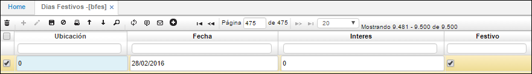

# Días Festivos - BFES

En la aplicación **BFES** se registran todos los días festivos que comprende cada año, esto depende del país donde nos ubiquemos.  

**Ubicación:** Número de ubicación de la empresa donde se desean registrar los días festivos.  
**Fecha:** Fecha del día festivo a registrar.  
**Festivo:** Se marca el Check para indicar que es un día festivo.  

