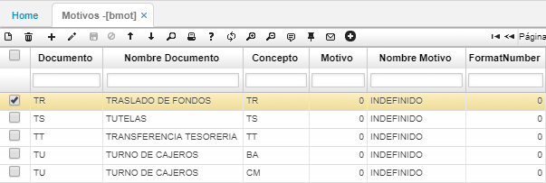
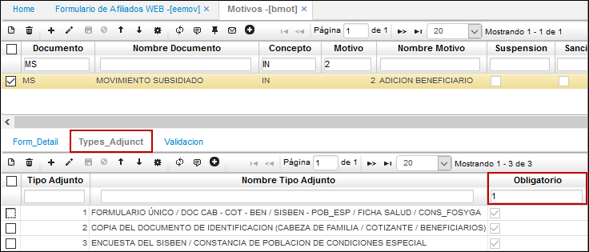

# Motivos - BMOT

La aplicación **BMOT** permite el registro de los diferentes motivos por los cuales se pueden generar documentos. Documentos y conceptos previamente parametrizados en **BDOC** y **BCON** respectivamente.  

**Documento:** siglas del documento con el cual se relacionará el motivo a registrar.  
**Concepto:** siglas del concepto con el cual se relacionará el motivo a registrar.  
**Motivo:** número de identificación asignado al motivo que se registra.  
**Nombre motivo:** nombre asignado al motivo que se registra.  

## [Parametrización Anexos EEMOV](http://docs.oasiscom.com/Operacion/common/bsistema/bmot#parametrización-anexos-eemov)

En BMOT se realiza la parametrización de los documentos que deben ir anexos al formulario de afiliación de la aplicación [**EEMOV - Formulario de Afiliados WEB**](http://docs.oasiscom.com/Operacion/crm/portal/cliente/eemov). A continuación, adjuntamos los documentos: formulario único, copia del documento de identificación y encuesta del sisben. Estos documentos son de carácter obligatorio de acuerdo a la parametrización realizada en la aplicación BMOT – Motivos para el documento MS, concepto IN y motivo 2.

