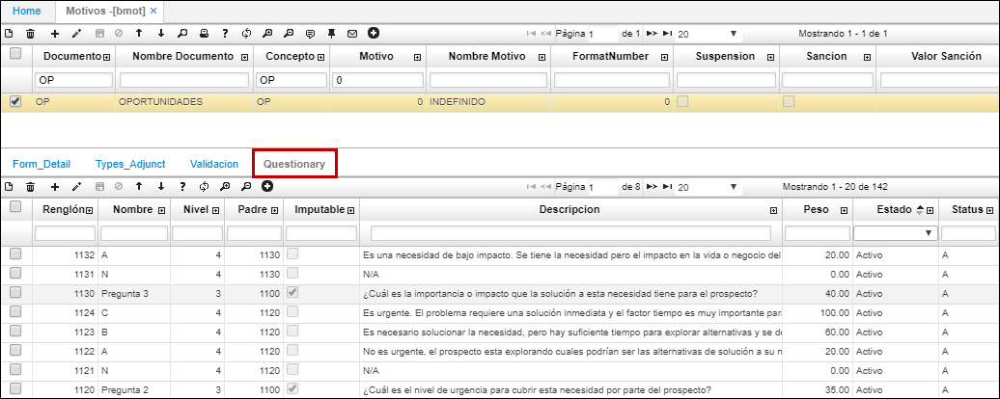
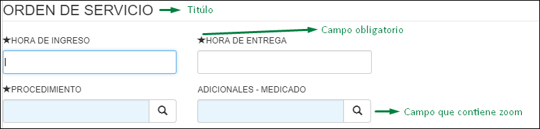
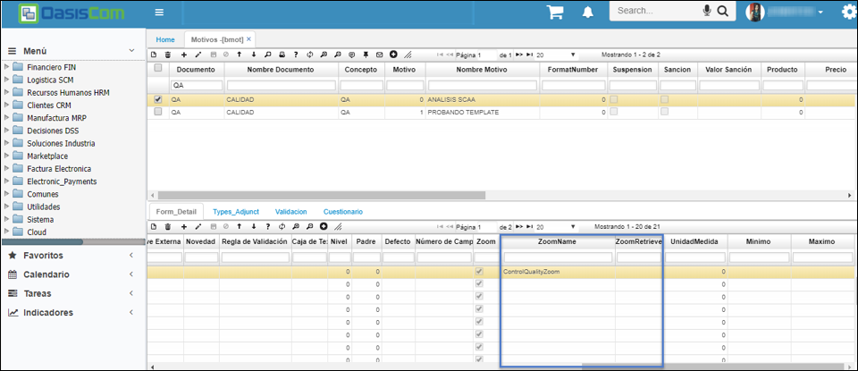
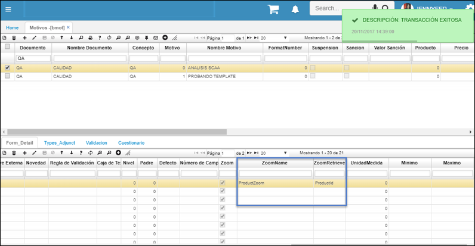
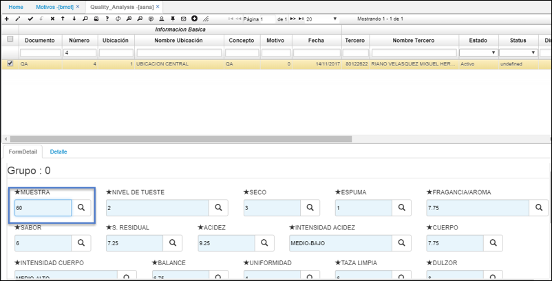
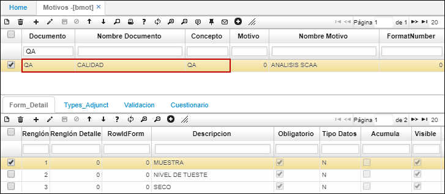
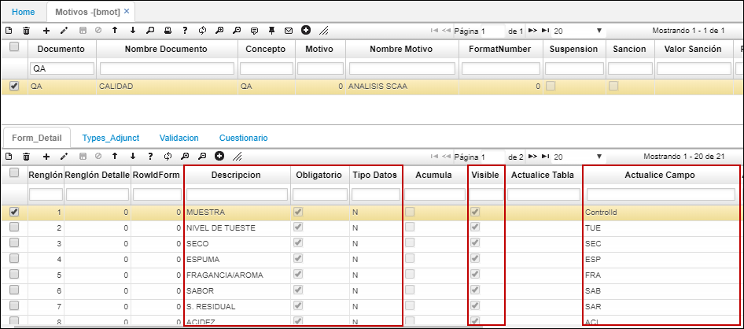
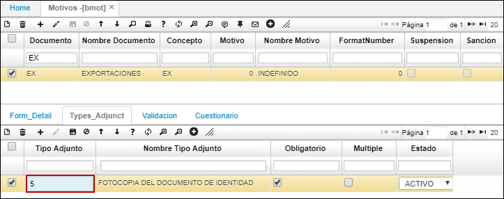
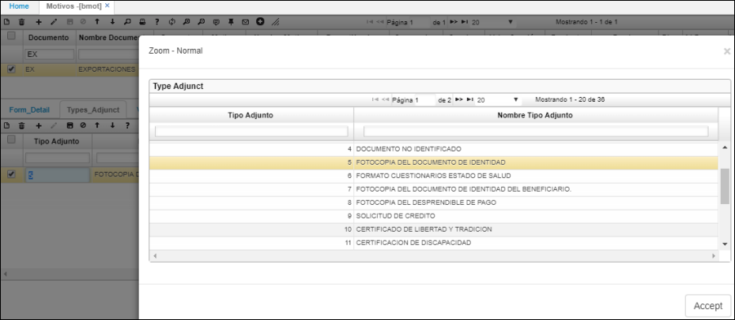
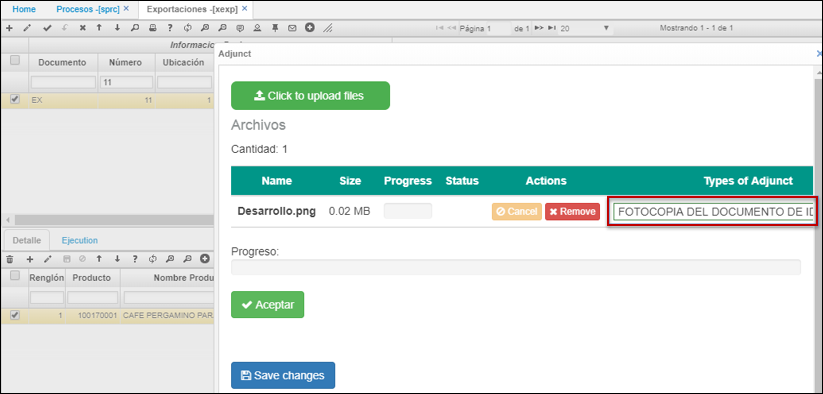

# Motivos - BMOT

La aplicación **BMOT** permite el registro de los diferentes motivos por los cuales se pueden generar documentos. Documentos y conceptos previamente parametrizados en **BDOC** y **BCON** respectivamente.  

**Documento:** siglas del documento con el cual se relacionará el motivo a registrar.  
**Concepto:** siglas del concepto con el cual se relacionará el motivo a registrar.  
**Motivo:** número de identificación asignado al motivo que se registra.  
**Nombre motivo:** nombre asignado al motivo que se registra.  
**FormatNumber:** el campo FormatNumber permite elegir el formato de documento a imprimir de acuerdo a la parametrización de la opción BMOT. Este campo tiene en cuenta la secuencia de validación de impresión de un formato, de acuerdo al campo 'FormatNumber' de la tabla motivos. El sistema validará documento, concepto, motivo.  

La aplicación **BMOT** cuenta con una pestaña llamada _Cuestionario_ en donde se podrán definir las preguntas relevantes a calificar en un proceso comercial.  

## [Parametrización Anexos EEMOV](http://docs.oasiscom.com/Operacion/common/bsistema/bmot#parametrización-anexos-eemov)

En BMOT se realiza la parametrización de los documentos que deben ir anexos al formulario de afiliación de la aplicación [**EEMOV - Formulario de Afiliados WEB**](http://docs.oasiscom.com/Operacion/crm/portal/cliente/eemov). A continuación, adjuntamos los documentos: formulario único, copia del documento de identificación y encuesta del sisben. Estos documentos son de carácter obligatorio para el documento MS, concepto IN y motivo 2.

## [Creación formularios](http://docs.oasiscom.com/Operacion/common/bsistema/bmot#creación-formularios)

En esta aplicación se puede realizar la parametrización de formularios se debe indicar a que documento se requiere realizar y en el detalle en la pestaña Form Detail registrar lo siguiente:

**Renglón:** Consecutivo  
**Descripción:** Nombre del campo que se requiere ver en el formulario  
**Obligatorio:** Activar el flag en caso que el campo se deba diligenciar obligatoriamente y dejarlo inactivado en caso que sea opcional  
**Tipo de datos:** Indicar T en caso de requerir que el diligenciamiento del campo sea texto, indicar D en caso que sea fecha y A en caso que se requiere un campo grande para diligenciar  
**Visible:** Activar el flag en caso que el campo sea visible  
**Actualice Campo:** Aquí se debe diligenciar el mismo campo de la aplicación ECRC - Características que se llama Nombre del campo, esto aplica sólo para los campos que van a tener zoom, es decir, se debe seleccionar alguna de las opciones allí parametrizadas.   
**Etiqueta:** Registrar SI en caso que el campo se comporte cómo título  
**Fila posición:** Aquí se debe registrar el número de la fila en la cual se requiere ver el campo  
**Posición Columna:** Aquí se debe registrar el número de la columna en la cual se requiere ver el campo  
**Zoom:** Se debe activar el flag en caso que el campo vaya actuar como zoom, es decir, que se seleccionen las opciones que se encuentran allí parametrizadas.  

## [Parametrización zoom formularios dinámicos](http://docs.oasiscom.com/Operacion/common/bsistema/bmot#parametrización-zoom-formularios-dinámicos)

En el detalle de la opción **BMOT - Motivos** se agregan los campos _ZoomName_ y _ZoomRetrive_, los cuales permitirán elegir el campo o columna a retornar en un zoom de un formulario dinámico.  

Por ejemplo, para la opción **AANA - Análisis de Calidad**, cuyo documento corresponde a QA, se parametriza en el zoom _Muestra_, que el campo a retornar será _ProductId_ del zoom _ProductZoom_. Se parametriza de la siguiente manera.  

Se debe tener en cuenta el campo _Tipo Datos_ para el dato del campo a parametrizar, dado que si solo recibe datos numéricos y se parametriza un dato que retorne letras o caracteres, al guardar el formulario mostrará error de data.  

Una vez se parametriza el documento en la opción **BMOT - Motivos**, verificamos el campo en la aplicación **AANA - Análisis de Calidad**.  

Al abrir el zoom, mostrará el zoom de producto y al seleccionar un registro, deberá retornar el Id del producto.  

## [Parametrización formularios dinámicos opción AANA - Análisis de Calidad](http://docs.oasiscom.com/Operacion/common/bsistema/bmot#parametrización-formularios-dinámicos-opción-aana---análisis-de-calidad)

En esta opción será parametrizado el motivo y el formulario dinámico de la primera pestaña del detalle de la opción [**AANA - Análisis de Calidad**](http://docs.oasiscom.com/Operacion/utility/calidad/bregis/aana), así:  

En el maestro se ingresa el documento y concepto previamente parametrizados en [**BDOC - Documentos**](http://docs.oasiscom.com/Operacion/common/bsistema/bdoc#parametrización-proceso-análisis-de-calidad).  

En el detalle, se debe parametrizar el formulario dinámico del detalle de la opción [**AANA - Análisis de Calidad**](http://docs.oasiscom.com/Operacion/utility/calidad/bregis/aana), de la siguiente manera:  

**Descripción:** ingresar el nombre del campo.  
**Obligatorio:** se activa o desactiva el flag dependiendo de si el campo es obligatorio o no.  
**Tipo Datos:** se ingresa el tipo de dato del campo a parametrizar. Los tipos de dato son:  

 * N: Numérico  
 * T: Texto  
 * A: Área de texto  
 * D: Fecha  
 * H: Hora  
 * C: CheckBox  

**Visible:** se activa o desactiva el flag, dependiendo de si el campo será visible o no.  
**Actualice campo:** se deben ingresar los nemotécnicos o Id de los campos. Para el caso de la opción [**AANA - Análisis de Calidad**](http://docs.oasiscom.com/Operacion/utility/calidad/bregis/aana), los nemotécnicos son los siguientes:  

* Muestra: **ControlId**  
* Nivel de Tueste: **TUE**  
* Seco: **SEC**  
* Espuma: **ESP**  
* Fragancia / Aroma: **FRA**  
* Sabor: **SAB**  
* S. Residual: **SAR**  
* Acidez: **ACI**  
* Intensidad Acidez: **IAC**  
* Cuerpo: **CUE**  
* Intensidad Cuerpo: **ICU**  
* Balance: **BAL**  
* Uniformidad: **UNI**  
* Taza Limpia: **TLI**  
* Dulzor: **DUL**  
* Puntaje Catador: **PCA**  
* Número Tazas: **NTA**  
* Intensidad: **INT**  
* Defecto1: **Failure**  
* Defecto2: **Failure**  
* Defecto3: **Failure**  

**Zoom:** se activa o desactiva el flag dependiendo de si el campo corresponde o no a un zoom.  

## [Parametrización de Adjuntos](http://docs.oasiscom.com/Operacion/common/bsistema/bmot#parametrización-de-adjuntos)

En la pestaña del detalle _Types_Adjunct_ de la aplicación **BMOT**, se deben parametrizar los tipos de adjuntos por documento y motivo y si son obligatorios así:  

En el maestro ingresaremos el documento al cual se le parametrizará el adjunto.  

**Tipo Adjunto** seleccionar del zoom de ayuda el tipo de archivo.  

**Obligatorio:** si el adjunto es obligatorio se debe activar el flag.  
**Estado:** se debe seleccionar si el adjunto está activo o no.  

De esta manera, al adjuntar documentos por ejemplo para la opción **XEXP**, se mostrará un listBox para la selección del tipo de adjunto.  

