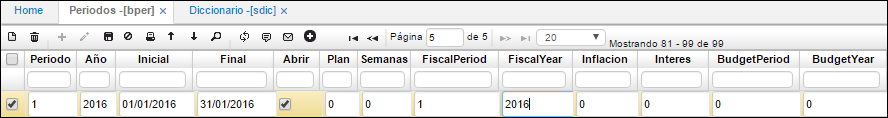

# Periodos - BPER

Esta aplicación permite definir los períodos en los cuales la empresa requiere analizar su información. Normalmente los periodos en las empresas son definidos mensualmente, de acuerdo a esto, se define un periodo para cada uno de los meses del año. Si la empresa requiere un periodo más pequeño o un periodo más grande con esta tabla se puede realizar (Bimestral, Trimestral, Semestral, etc.). Se define un número de periodo para cada una de las fechas del sistema quiere decir que cada vez que hay un movimiento, él verifica el periodo al cual corresponde por medio de esta tabla. También se debe tener en cuenta las columnas del año fiscal que son para los países que manejan el año fiscal de septiembre a octubre en ese caso se utiliza las columnas.  

**Periodo:** número que se le asigna al periodo que se registra.  
**Año:** año correspondiente al periodo que se registra.  
**Inicial:** fecha inicial del periodo.  
**Final:** fecha final del periodo, puede comprender 2 o más meses, comúnmente es mensual.  
**Abrir:** se marca el Check si desea que el periodo esté abierto, es decir, activo para realizar movimientos o transacciones en el sistema durante este tiempo.  
**Periodo fiscal:** número del periodo fiscal registrado.  
**Año fiscal:** año fiscal, si maneja la compañía.  

En la pestaña Módulos en el detalle, se registran los módulos que se trabajarán en el periodo registrado en el maestro.  

**Año:** año correspondiente al periodo registrado en el maestro.  
**Periodo:** número del periodo registrado en el maestro y al cual se le asignarán los módulos a operar.  
**Módulo:** nombre del módulo a operar en el periodo registrado.  
**Abrir:** se marca el Check si desea que el periodo esté abierto, es decir, activo para realizar movimientos o transacciones en el sistema durante este tiempo.  

