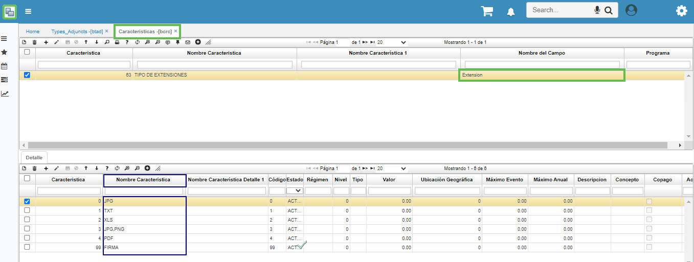
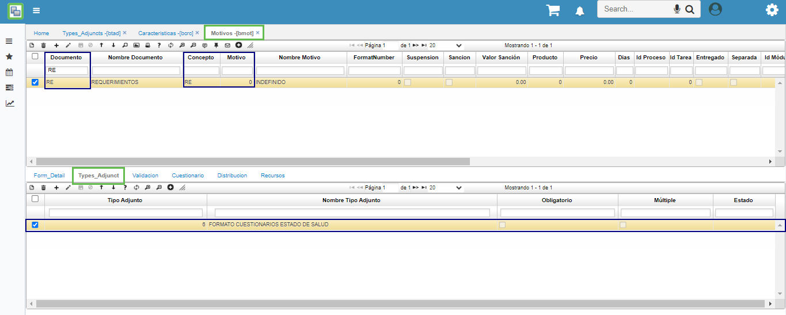
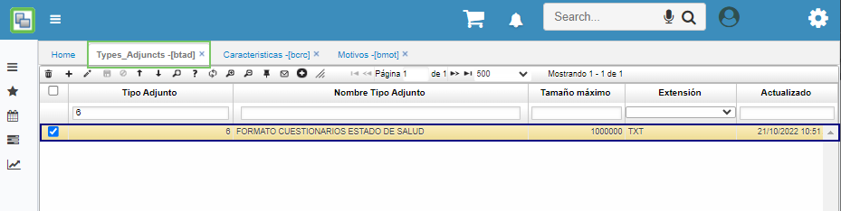
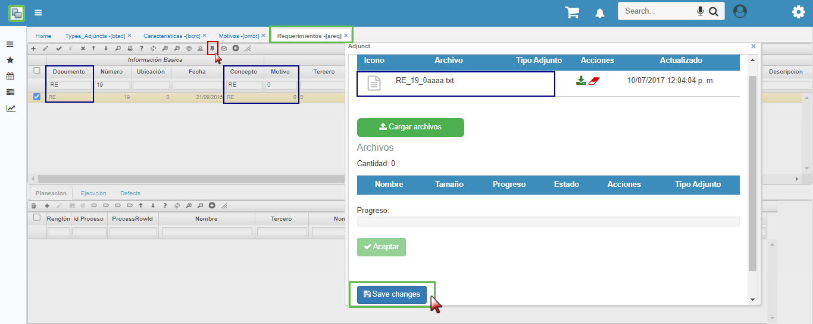

# Tipos Adjuntos - BTAD

Está aplicación permite crear los tipos de adjuntos que se utilizan para el cargue de archivos en las diferentes aplicaciones.   

**Tipo adjunto:** Número que identifica el tipo de adjunto.  
**Nombre tipo adjunto:** Nombre del tipo de adjunto a registrar.  
**Tamaño máximo:** Tamaño máximo (en bytes) del documento permitido para adjuntarlo a un movimiento.  
**Extensión:** Tipo de extensión del archivo, por ejemplo, JPG – Formato de Imagen, TXT – Formato de Texto por tabulaciones.  

Estas extensiones deben ser creadas desde la aplicación **BCRC – Características** donde se parametriza por el Nombre del Campo (Extensión) y en el detalle los tipos de extensiones que se van a adjuntar en estado activo, tal como se muestra en la imagen.

Después de realizar la parametrización de las extensiones, Sobre el modulo [**BMOT - Motivos**](https://docs.oasiscom.com/Operacion/common/bsistema/bmot) se debe indicar en la pestaña *Types_Adjunct* los tipos de extensiones que se pueden adjuntar sobre el documento – concepto y motivo que se desea, esto llamando el zoom del detalle que nos muestra los tipos de extensiones creados anteriormente en el **BTAD - Tipos Adjuntos**.

Una vez culminada la parametrización sobre el **BMOT - Motivos** para el documento – concepto y motivo correspondiente, se podrá adjuntar los archivos con la extensión parametrizada. 

