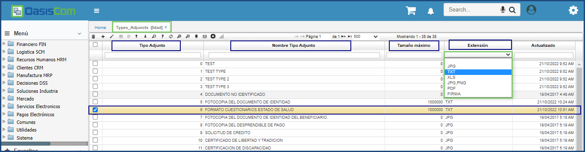

# Tipos Adjuntos - BTAD

La aplicación **BTAD** permite parametrizar los tipos de adjuntos que se pueden subir en las aplicaciones.  

**Tipo adjunto:** Número que identifica el tipo de adjunto.  
**Nombre tipo adjunto:** Nombre del tipo de adjunto a registrar.  
**Tamaño máximo**: Tamaño máximo del documento permitido para adjuntarlo a un movimiento.  

