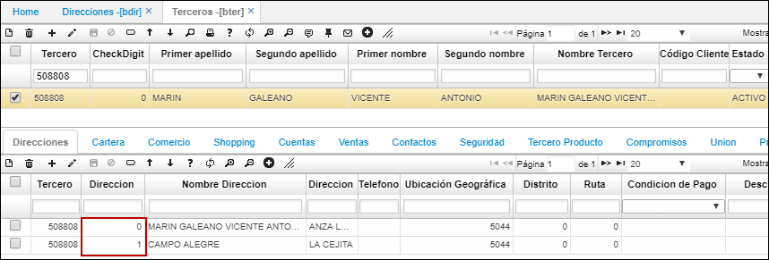
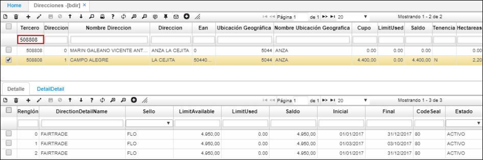
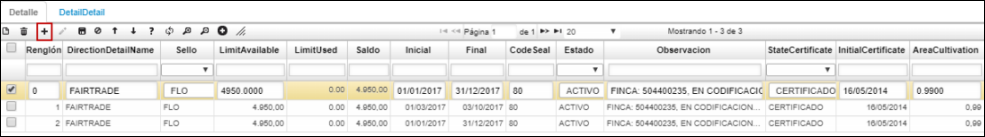
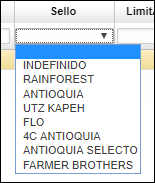
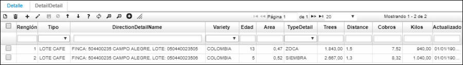

# BDIR - Direcciones

La aplicación BDIR permite registrar las fincas y especificar sus caracteristicas. En el detalle se ingresan los sellos de calidad que posea cada finca y  en la siguiente pestaña del detalle caracteristicas de los lotes.  

Al crear inicialmente el tercero en la aplicación **BTER** y diligenciar la pestaña _Direcciones_ con las fincas que posea el tercero, el sistema alimentará la aplicación BDIR. Si la persona cuenta con más de una finca, se irá generando consecutivo a cada finca.  

En el maestro de la aplicación BDIR veremos las direcciones ingresadas anteriormente en la opción BTER, aquí podremos adicionar características especiales de las fincas como: ubicación geográfica, veredas, cupo de producción, cantidad de producción consumida, saldo de producción, tenencia de la propiedad, número de hectareas de la finca, especificar la cantidad de producción por tipo de café, entre otras.  

Consultamos por el número de identificación del tercero.  

En el detalle, agregaremos los sellos de calidad que posee la finca y algunas características.  

**Sello:** seleccionar de la lista el sello de calidad que se desea registrar a la finca.  

**Limit Available:** ingresar la cantidad de kilos de café que tiene de cupo ese sello de calidad.  
**Limit Used:** el sistema calcula los kilos vendidos a la cooperativa y muestra la cantidad.  
**Saldo:** el sistema calcula el saldo de kilos que quedan disponibles del sello de café.  
**Inicial y Final:** ingresar la fecha inicial y final del cultivo, se realiza anual.  
**Code Seal:** ingresar el código interno de la cooperativa.  
**Estado:** seleccionar si el estado es _Activo, Retirado_ o _Inactivo_.  
**Observación:** opcional ingresar una observación.  
**Estado Certificado:** seleccionar si el sello de calidad se encuentra _CERTIFICADO_ o _EN PROCESO_.  
**Fecha inicial certificado:** indicar la fecha desde que se obtuvo el certificado.  

Guardamos los cambios e ingresamos a la pestaña _Detalle Detalle_.  

En la pestaña _Detalle Detalle_ ingresamos información referente a los lotes de la finca.  

En el campo _Tipo_, seleccionamos si el registro es un lote de café, si es especial, en construcción, si el registro es Agroquímico, el cual identifica la cantidad de químicos y fertilizantes que tiene la finca para la producción.  

También ingresamos datos como la variedad de café a la que aplica el tipo, la edad del lote, el área, entre otras. Es posible visualizar la fecha en que se actualiza el registro.  

