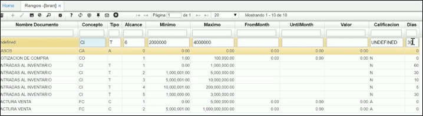

## Rangos - BRAN

## [Inventario Cíclico](http://docs.oasiscom.com/Operacion/common/btercer/bran#inventario-cíclico)

Para realizar el inventario cíclico es necesario parametrizar previamente en la aplicación **BRAN** los rangos de los valores que corresponden al total de inventario y que se tendrán en cuenta al momento de generar dicho inventario.  

Agregamos un nuevo registro y diligenciamos los siguientes campos.  

**Documento:** ingresar documento EN correspondiente a _Entradas al Inventario_.  
**Concepto:** ingresar el concepto que la empresa haya parametrizado en la aplicación [**BDOC - Documentos**](http://docs.oasiscom.com/Operacion/common/bsistema/bdoc) para este tipo de documento. En este caso, el concepto será CI correspondiente a _Cargue Inicial por Inventario Físico_.  
**Tipo:** ingresar la letra **T** correspondiente a _Terminado_.  
**Id del Rango:** asignar el número de renglón para cada rango, este número es el que identifica cada rango en las demás aplicaciones que lo requieran.  
**Mínimo:** ingresar el valor mínimo del rango que se regista.  
**Máximo:** ingresar el valor máximo del rango que se registra. Este valor corresponde a la suma del total de productos inventariados.  
**Días:** ingresar la cantidad de días que se deberá realizar el inventario para cada rango.  

Parametrizados los rangos, ingresaremos a la aplicación [**IFPI - Prepara Inventario Diario**](http://docs.oasiscom.com/Operacion/scm/inventarios/ifisico/ifpi#inventario-cíclico), en donde se generará el proceso para realizar el inventario cíclico.  
