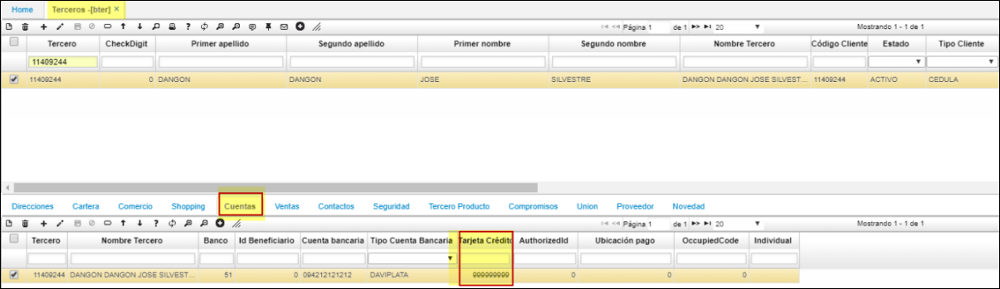
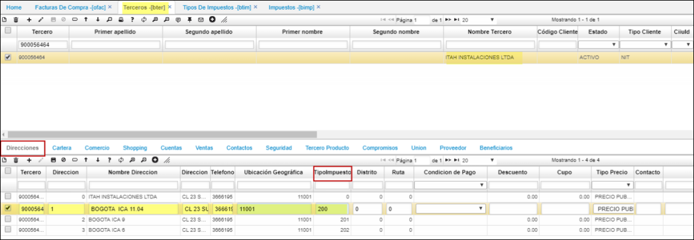
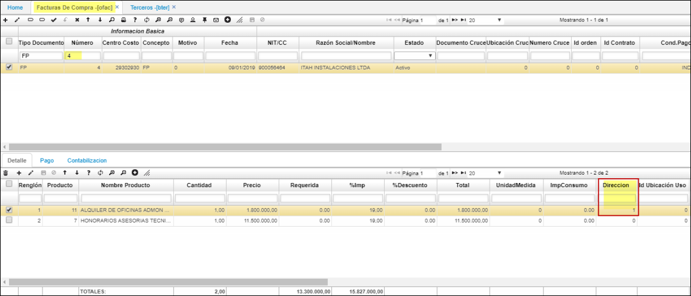
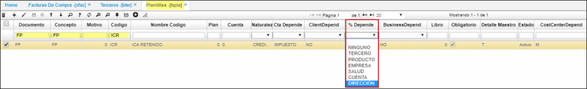
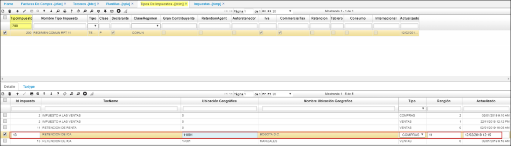
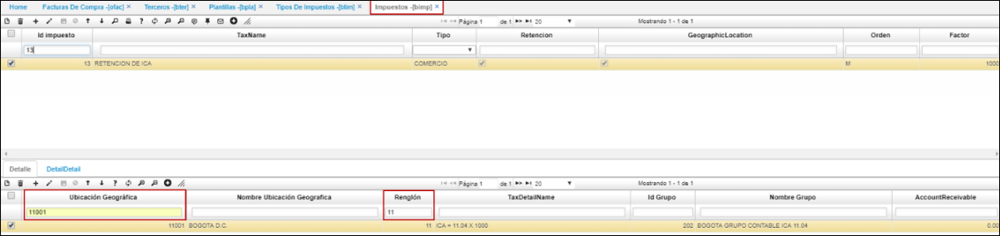
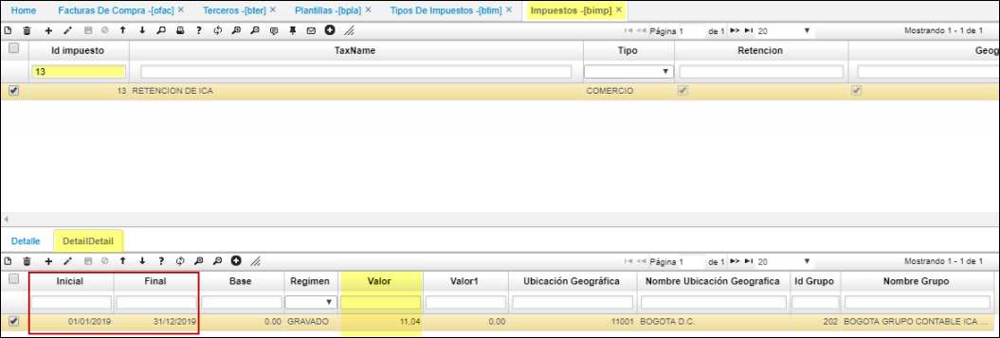

# TERCEROS - BTER

**Menú**

* [Parametrización Tipos de Precio](http://docs.oasiscom.com/Operacion/common/btercer/bter#parametrizacion-tipos-de-precio)  
* [Parametrización de Terceros para la Liquidación de Comisiones](http://docs.oasiscom.com/Operacion/common/btercer/bter#parametrizacion-de-terceros-para-la-liquidación-de-comisiones)  
* [Parametrización fidelización de clientes](http://docs.oasiscom.com/Operacion/common/btercer/bter#parametrización-fidelización-de-clientes)

En esta aplicación parametrizamos o registramos todos los terceros que podemos tener, para el sistema Oasis la palabra terceros se hace referencia a: empleados, clientes, proveedores, afiliados, vendedores, asociados, entre otros. Es decir, todas las personas que interactúan o se relacionan con nuestro negocio.

Si la persona que se va a ingresar a la opción **BTER – Terceros**, es empleado de la compañía es importante diligenciar la fecha exacta de ingreso a la empresa y activar el Check _Empleado_, de esta manera al ingresar a la siguiente opción **NBEM – Empleados** solo se debe consultar por número de cédula y editar los campos del maestro que hagan falta.

El maestro cuenta con el campo **CiiuId** el cual permite seleccionar de una lista desplegable la actividad económica del tercero. Las actividades económicas que se visualizan en la lista son parametrizables en la aplicación [**BCRC - Características**](http://docs.oasiscom.com/Operacion/common/bcomer/bcrc).  

_Parametrización en BCRC._

Campo _CiiuId_

En el detalle de la aplicación BTER, se diligenciarán automáticamente algunas pestañas de acuerdo con la información registrada en el maestro. En la pestaña _Novedad_, es posible visualizar las novedades ingresadas previamente en las aplicaciones ZNOV - Novedades Asociados y BNOV - Novedades.  

## [Parametrización Tipos de Precio](http://docs.oasiscom.com/Operacion/common/btercer/bter#parametrizacion-tipos-de-precio)

Para realizar correctamente la parametrización, se debe asignar inicialmente el tipo de precio en la aplicación **BTER** en el campo _Tipo Precio_.  

Seleccionamos el tercero, ingresamos el tipo de precio y damos click en el botón _Guardar_.  

Seguidamente, nos dirigimos a la aplicación [**BUBI - Ubicaciones Organización**](http://docs.oasiscom.com/Operacion/common/borgan/bubi) en donde continuaremos con la parametrización de Tipo de Precio.  

## [Parametrización de Terceros para la Liquidación de Comisiones](http://docs.oasiscom.com/Operacion/common/btercer/bter#parametrizacion-de-terceros-para-la-liquidación-de-comisiones)

Para designar un _tipo de comisión_ a un tercero o cliente, se realiza desde la aplicación **BTER - Terceros**:  

Se consulta el tercero correspondiente y se ingresa a la pestaña _Ventas_ del detalle:  

En el campo _**PlanComission**_, se deberá ingresar el Id del tipo de comisión correspondiente, los cuales fueron parametrizados en la opción [**FBPC - Tipos de Comisión**](http://docs.oasiscom.com/Operacion/scm/facturacion/fbasica/fbpc):

Realizada la parametrización correspondiente de los terceros y de los tipos de comisión en la aplicación [**FBPC - Tipos de Comisión**](http://docs.oasiscom.com/Operacion/scm/facturacion/fbasica/fbpc), continuaremos a ejecutar el proceso especial de liquidación de comisiones en la aplicación [**FCLI - Liquidación de Comisiones**](http://docs.oasiscom.com/Operacion/scm/facturacion/fcomision/fcli).

## [**Parametrización fidelización de clientes**](http://docs.oasiscom.com/Operacion/common/btercer/bter#parametrización-fidelización-de-clientes)

En la aplicación **BTER** se deben registrar los clientes que podrán acumular puntos. En el momento del registro, se deberá marcar el flag _**Frecuente**_ ubicado en la pestaña del detalle llamada _Ventas_, esto permitirá al sistema identificar que por cada compra que realice dicho cliente, este acumulará puntos.  

_Conoce todo el proceso de Fidelización de Clientes_ [**Aquí**](http://docs.oasiscom.com/Operacion/scm/pos/jcajero/jfac#fidelizaci%C3%B3n-de-clientes).  

En la aplicación **BTER** Básico de Terceros, en la pestaña Cuentas parte inferior (detalle) podrá parametrizar  el numero de la tarjeta de crédito para legalizacion de Viaticos a dicho tercero;  insertando un nuevo renglón como se ilustra.

## [**Parametrización tipo de Impuesto ICA - Tercero para compras.**

Desde el BTER en la pestaña “Direcciones” puede parametrizar el tipo de Impuesto [BTIM], para asignar porcentaje de ICA por cada una de las referencias relacionadas en el detalle de una factura de compra [OFAC].
Para tal efecto realizaremos el ejemplo con el tercero: 900056464 - ITAH INSTALACIONES LTDA. Donde la factura de compra [OFAC], debe de aplicar el tipo de impuesto [BTIM]=200; 
DIRECCION 1= RTE ICA BOGOTÁ 11.04 X 1000  

Realizamos el [OFAC]= 4 con el tercero: ITAH INSTALACIONES LTDA
Insertamos la dirección 1 en el detalle del OFAC.

Parametrizamos en BPLA la plantilla.
Donde el documento FP por concepto FP y el código ICR=ICA RETENIDO; se le aplique % Depende = DIRECCIONES. Como se ilustra.  

El tercero del **[OFAC]**=4 posee el tipo de impuesto 200= REGIMEN COMUN RFT 11
El impuesto que aplica es el número=13 RETENCION DE ICA.
Ubicación geográfica [BUBG]=11001 Bogotá.
Ingresa por el renglón 11 para el tipo: Compras.  

Ahora ingresamos a el impuesto [BIMP]=13 RETENCION DE ICA.
Renglón 11  

Y en la pestaña: "detalle detalle".
Validamos la vigencia, que las fechas estén entre el rango del OFAC=4 donde el valor es 11.04 que debe de ser aplicado en la contabilización del OFAC.
Al procesar el OFAC refleja esta cuenta.  

