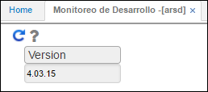
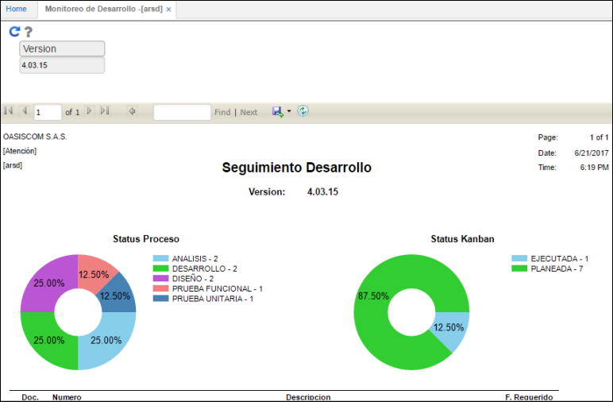
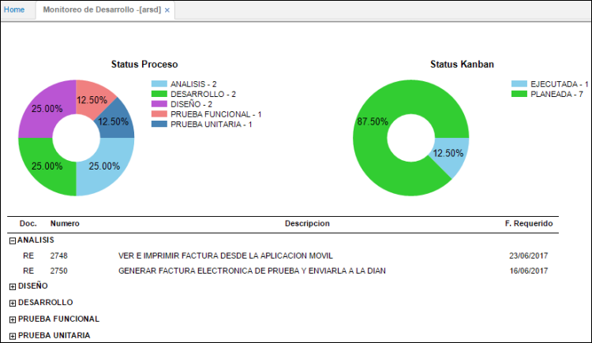

# ARSD - Monitoreo de Desarrollo

La aplicación ARSD permite realizar seguimiento detallado a las actividades de desarrollo por estado.  

Se realiza el filtro por el número de versión.  

Al consultar el sistema arrojará la información en una gráfica estadísitica, desglosando en porcentajes cada fase de desarrollo.  

En el detalle se especifican las actividades que componen las fases.

