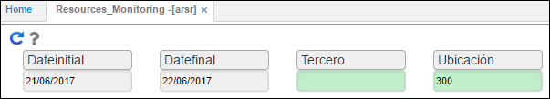
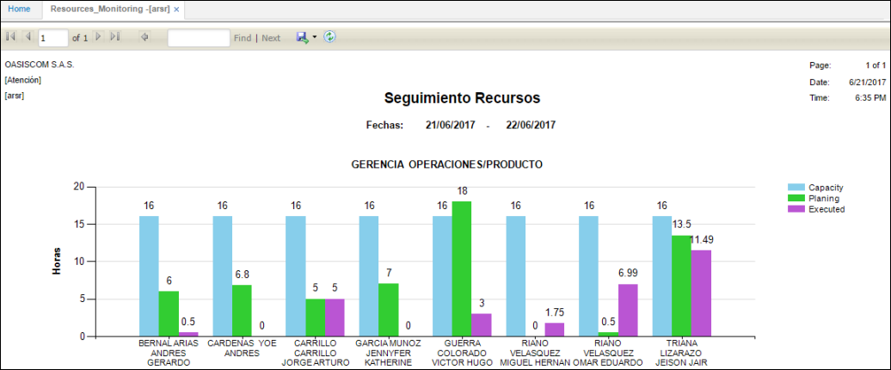
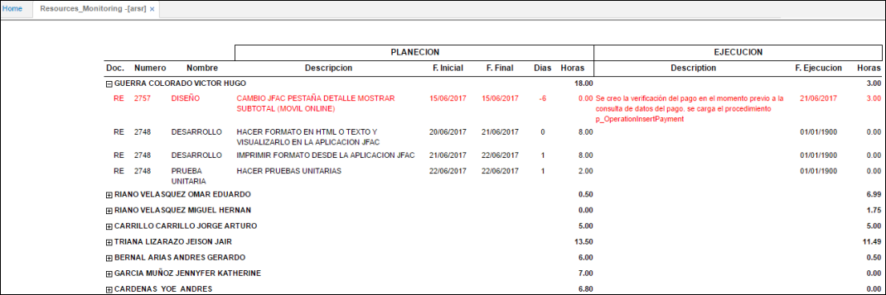

# ARSR - Monitoreo de Recursos

La aplicación ARSR permite realizar seguimiento a los recursos, de acuerdo a las tareas planeadas, ejecutadas y su capacidad en horas de trabajo.  

Se puede filtrar por rango de fechas, identificación del trabajador y área a la cual pertenece.  

Al realizar la consulta, en este caso por área, la aplicación arrojará una gráfica de barras indicando la capacidad en horas de acuerdo a las fechas filtradas anteriormente, las horas planeadas y las horas ejecutads.  

En la parte inferior la aplicación trae un detalle, en el cual se ven las actividades planeadas a cada trabajador.  

#### **Color de las actividades:**

**_Negro:_** corresponde a las actividades que no se han ejecutado.  
**_Verde:_** Actividades planeadas y ejecutadas en el tiempo requerido.  
**_Rojas:_** Actividades planeadas y ejecutadas por fuera del tiempo requerido.  

El campo _días_ indica los días demás que se ha tardado el trabajador en hacer entrega de la actividad y el campo _Horas_ la cantidad de horas planeadas para esa actividad.  

