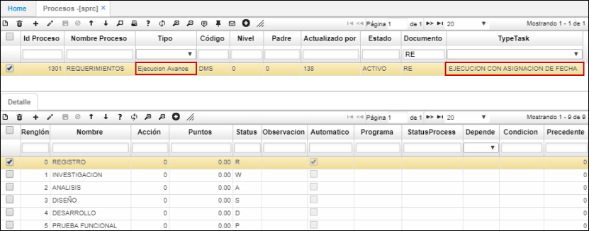
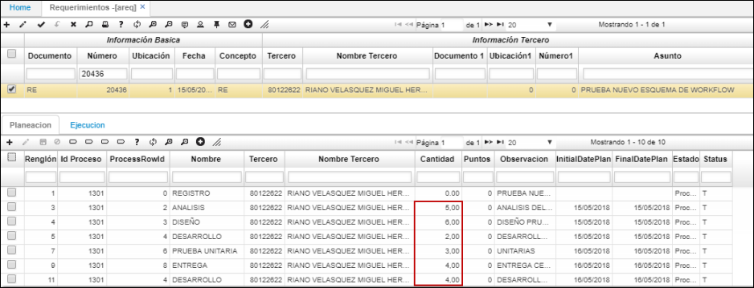
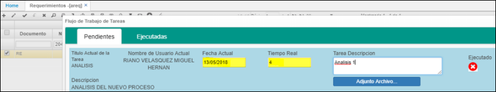
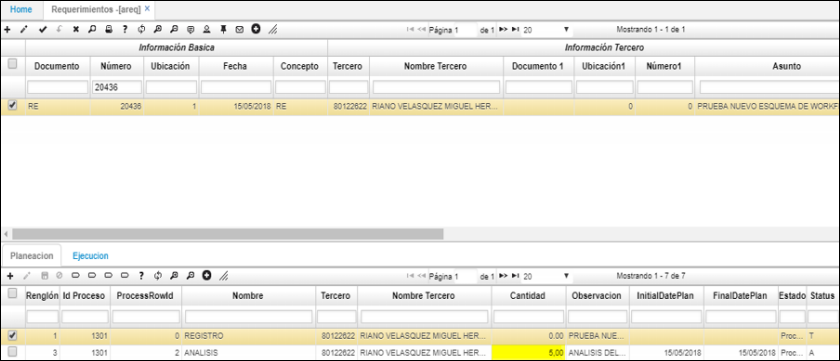
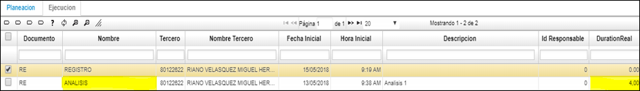
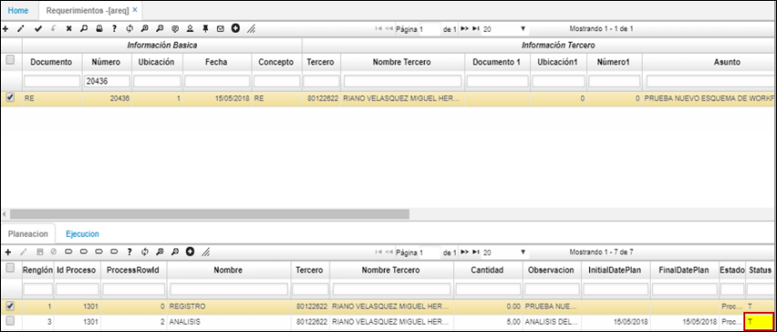
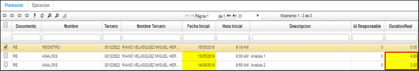
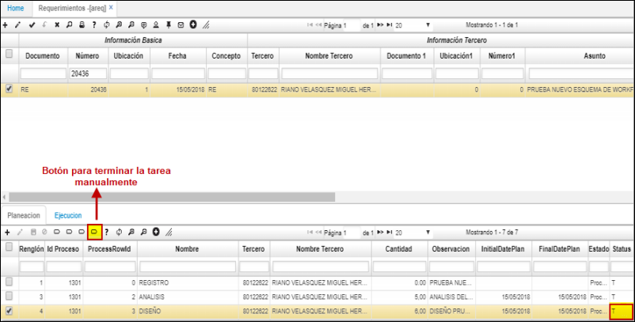
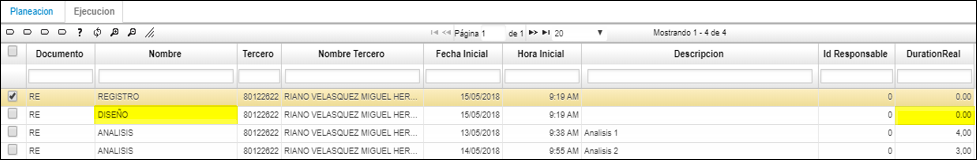

# AREQ - Requerimientos

La aplicación AREQ permite registrar los requerimientos y asignarlos a los connsultores para su ejecución.  

## [Esquema de Work Flow](http://docs.oasiscom.com/Operacion/crm/development/derequerimiento/areq#esquema-de-work-flow)

El esquema de ejecucion de tareas permite hacer los siguiente:  

1. Ejecutar tareas de forma parcial.  
2. Que las tareas se permitan ejecutar en horas.  
3. Poder terminar tareas si estas estan procesadas y tienen ejecucion parcial o sin ejecucion.  

Inicialmente, realizamos una parametrización en la aplicación SPRC - Procesos.  

**Tipo:** Indica que la ventana de workflow pide fecha de ejecución y el tiempo en horas.  
**TypeTask:** Indica que el proceso de workflow permite ejecució con avance en sus tareas.  

En la aplicación AREQ, registramos la tarea a realizar y en el detalle ingresamos las actividades que se deben ejecutar para culminarla.  

Parametrización de actividades con horas de ejecución.  

Flujo de trabajo de tareas.  

**Fecha Actual:** fecha en que se ejecuta la tarea.  
**Tiempo Real:** número de horas utilizadas en la ejecución de la tarea.  

El registro no cambiará así tenga ejecuciones parciales, cambiará cuando se ejecute en un 100%.  

En la pestaña _Ejecución_ podemos ver la tarea ejecutada anteriormente.  

La actividad se termina si la ejecución fue del 100% o más.  

Si la suma de las ejecuciones supera la planeación por ende queda terminada la tarea.  

### Terminación de tareas

La tarea también puede ser tarminada manualmente, es _Status_ cambiará a T (Terminado).  

Al terminar la tarea queda con tiempo de ejecución en cero.  

