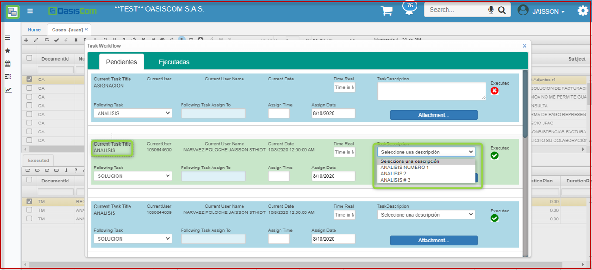
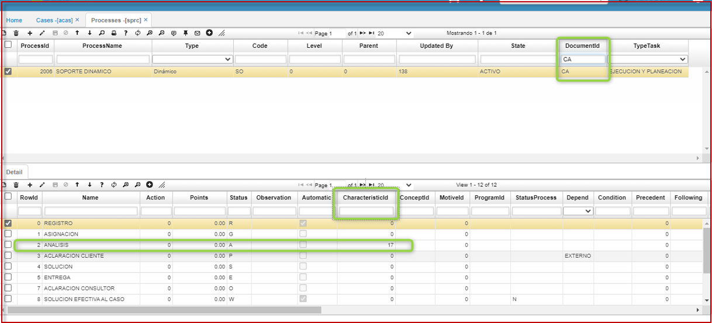
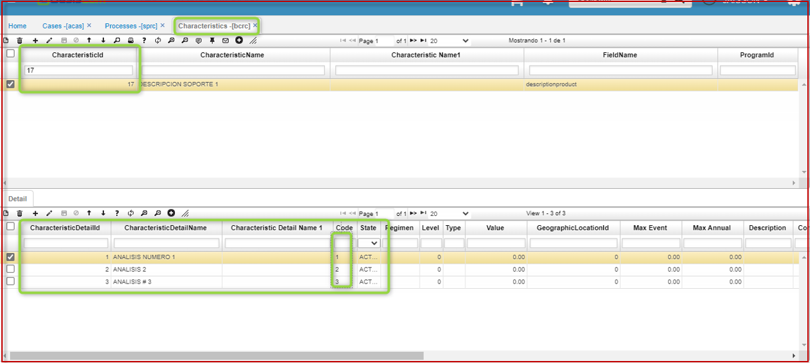
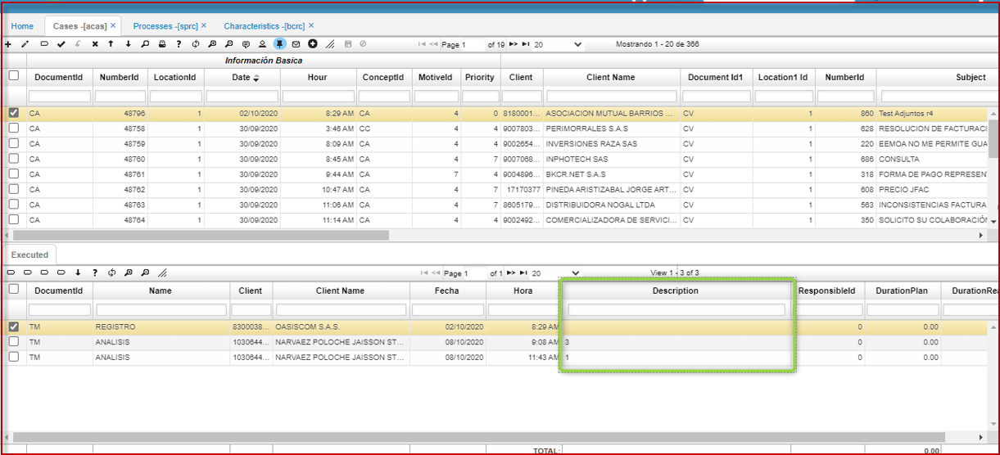
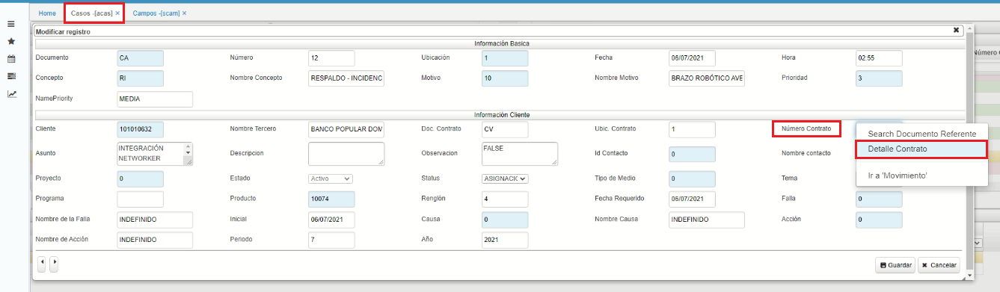
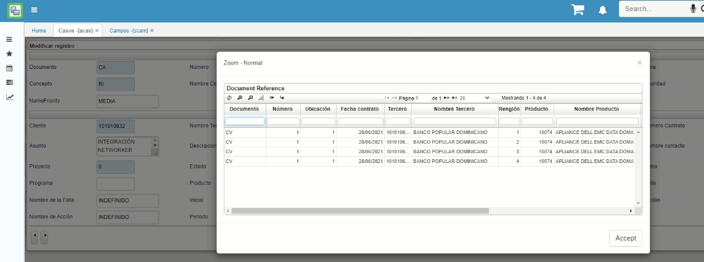

**Menú**
1. [Casos - ACAS](https://docs.oasiscom.com/Operacion/crm/helpdesk/hdcaso/casos---acas)
2. [Detalle de contrato](https://docs.oasiscom.com/Operacion/crm/helpdesk/hdcaso#detalle-de-contrato)

# [Casos - ACAS](https://docs.oasiscom.com/Operacion/crm/helpdesk/hdcaso/casos---acas)

En la aplicación **ACAS - Casos** se pueden observar todos los casos que se encuentran registrados desde la aplicación **ASOP - Soporte**, igualmente si no se registran desde dicha aplicación, en esta misma se puede realizar el registro.

En el maestro de la aplicación se pueden registrar campos cómo lo son:

**Documento:** Se tiene definido el documento CA de casos de soporte.  
**Número:** El sistema diligencia este campo automáticamente de acuerdo al consecutivo.  
**Fecha:** Fecha en la cual se registró el caso.  
**Hora:** Hora en la cual se registró el caso.  
**Prioridad:** Se asigna la prioridad correspondiente al caso registrado.  
**Tercero:** Número de NIT de la empresa la cual registró el caso.  
**Nombre Tercero:** Nombre de la empresa asociada al campo anterior, este campo no se debe diligenciar dado que se diligencia automáticamente de acuerdo al campo registrado anteriormente.  
**Asunto:** Título del caso.  
**Descripción:** Descripción detallada del caso identificado.  
**Id Contacto:** Número de cédula de la persona que realizó el registro del caso.  
**Nombre contacto:** Persona asociada al campo anterior.  
**Proyecto:** Si se tiene definido que los casos se asocien a un proyecto especifico, se debe diligenciar el número del proyecto correspondiente.  
**Status:** El status en el cual se encuentra el caso, este se va modificando automáticamente de acuerdo a las actividades ejecutadas del caso.  
**Producto:** En que producto se ha identificado el caso.  
**Fecha requerido:** Fecha en la cual se requiere la solución del caso y entrega al cliente.  
**Falla:** El caso se puede asociar a unas fallas parametrizadas, para posteriormente realizar estadísticas y mejoras para evitar el registro de un caso similar.  
**Causa:** El caso se puede asociar a una causa identificada.  

En el detalle se registran las actividades ejecutadas del caso seleccionado en el maestro, cabe resaltar que esta información no se agrega directamente en el detalle de la aplicación sino que se diligencia por medio de un flujo de trabajo, el cual se puede identificar en el botón Workflow-tasks, en donde se registra la actividad ejecutada, el tiempo requerido para solventar dicha actividad y una breve descripción de lo realizado.  

En el workflow tanto los ingenieros de soporte como los clientes pueden ejecutar actividades. Los ingenieros ejecutan lo que es registro, análisis, solución y/o cierre de caso. Cuando el cliente requiera hacer seguimiento o una aclaración sobre el caso registrado y que se encuentra activo en el sistema se habilitará la opción **"Aclaración Cliente"** para que allí diligencie lo requerido.  

>**Nota:** Tambien es posible mostrar una lista en el campo descripción de la ventana de ejecución de tareas **(workflow)**, para poder tabular esta información, **(ACAS)**. Se ajusta visualización a lista de descripción en la ejecución de tareas, se parametriza características **(BCRC)** y modifica el campo CharacteristicId del **SPRC** (Procesos).  

Como vemos en el momento de ejecutar las tareas tenemos el campo: **Análisis** con una lista para elegir que descripción seleccionaremos.  

  

Para poder utilizar esta funcionalidad debemos configurar la opción de Procesos **SPRC** y a nivel de detalle indicarle la característica que queremos utilizar.  

  

Para la lista es necesario crear una característica **(BCRC)**.  

  

Cuando se realiza la ejecución de las tareas, vemos que el valor que queda registrado es el de la característica seleccionada.  

    

Esta es la forma de parametrizar una lista en el campo descripción de la ventana de ejecución de tareas **(workflow)**  

#### [Detalle de contrato](https://docs.oasiscom.com/Operacion/crm/helpdesk/hdcaso#detalle-de-contrato)

La aplicación ACAS cuenta con un zoom que permite conocer el contrato del cliente que genera o carga al sistema el caso, en donde se puede visualizar: fecha del contrato, productos del contratos, fechas de vigencia, entre otros.  

El zoom se consulta desde el formulario de registro del caso, dando clic derecho en el campo **Número de contrato**, opción **Detalle contrato**.

    

    

*****

