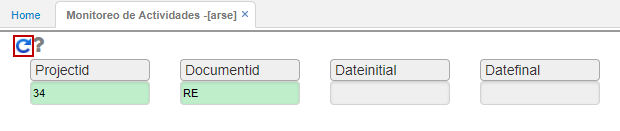
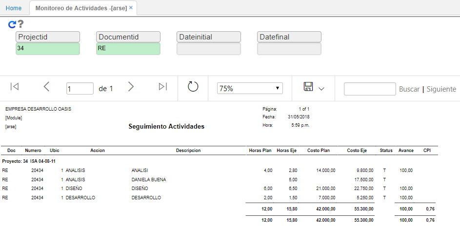

# ARSE - Monitoreo de Actividades

La aplicación **ARSE** permite realizar seguimiento a la planeación y ejecución por actividades.  

Es posible filtrar por proyecto, documento y rango de fechas.  

Al consultar, veremos las actividades, las horas planeadas y ejecutadas de las mismas, el costo de la planeación y de la ejecución, el status en el que se encuetra la actividad y el porcentaje de avance.  

El reporte puede ser exportado en formato de Excel, PDF o Word.  