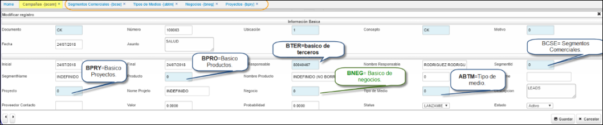

# Campaña - ACAM 

Aplicación que nos permite editar datos de las diferentes Campañas comerciales de la organizacion, en ella se guardan datos relevantes segun el tipo de medio, estrategias comerciales que tienen como objetivo dar a conocer el producto o servicios que se busca ofrecer, durante un periodo determinado.  Nos permite parametrizar las campañas de publicidad que se tienen al aire; esto nos permitirá asignar a los prospectos o contactos de la campaña por la que ingresaron y así validar la efectividad de nuestra estrategia de _Marketing_.  

Esta opcion **ACAM** al adicionar abre un formulario con estos campos a editar:  

  

**Documento:**  Parametrización del [**BDOC - Documentos**](http://docs.oasiscom.com/Operacion/common/bsistema/bdoc) [CK].  
**Número:**  Consecutivo parametrizado en [**BCNS - Consecutivos**](http://docs.oasiscom.com/Operacion/common/bsistema/bcns).  
**Ubicación:**  Parametrización realizada en [**BUBI - Ubicaciones**](http://docs.oasiscom.com/Operacion/common/borgan/bubi).  
**Concepto:**  Parametrizacion realizada en [**BDOC - Documentos**](http://docs.oasiscom.com/Operacion/common/bsistema/bdoc).  
**Motivo:**  Parametrización del [**BMOT - Motivos**](http://docs.oasiscom.com/Operacion/common/bsistema/bdoc).   
**Fecha:**  Data de emisión del documento al guardar.  
**Asunto:** Referencia breve del asunto, nombre de la campaña.  

**Inicial:** Fecha de inicio de la campaña.  
**Final:** Fecha de terminación de la campaña.  
**Responsable:** Parametrización del [**BTER - Terceros**](http://docs.oasiscom.com/Operacion/movil/bter) tercero.  
**Segmento:** Parametrización del [**BCSE - Segmentos Comerciales**](http://docs.oasiscom.com/Operacion/common/bcomer/bcse) Segmentos comerciales.  Se puede relacionar el segmento al que estará dirigida la campaña.  
**Tercero:** Parametrización del [**BTER - Terceros**](http://docs.oasiscom.com/Operacion/movil/bter) tercero.  
**Producto:** Parametrización del [**BPRO - Productos**](http://docs.oasiscom.com/Operacion/movil/bpro) producto.  Se puede relacionar el producto a promocionar.  
**Nombre de tipo de medios:**  Parametrización del [**ABTM - Tipos de Medios**](http://docs.oasiscom.com/Operacion/crm/servicio/abasica/abtm).  Se puede relacionar el tipo de medio al que se relacionará la campaña.  
**Proyecto:** Zoom del [**BPRY - Proyectos**](http://docs.oasiscom.com/Operacion/common/bfinan/bpry).  
**Negocio:** Zoom del [**BNEG - Negocios**](http://docs.oasiscom.com/Operacion/common/bfinan/bneg).  
**Estado:** Activo, procesado, anulado.  
**Status:** puede ser: expectativa, fidelizacion, lanzamiento, posicionamiento, reactivacion, social...entre otras .  

Diligenciado el formulario, se guarda y queda finalizada la paramtrización.  

********

