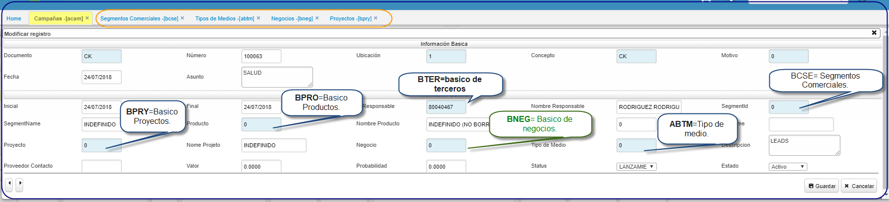

# CAMPAÑA - ACAM 

Aplicación que nos permite editar datos de las diferentes Campañas comerciales de la organizacion, en ella se guardan datos relevantes segun el tipo de medio, estrategias comerciales que tienen como objetivo dar a conocer el producto o servicios que se busca ofrecer, durante un periodo determinado.  
Esta opcion **ACAM** al adicionar abre un formulario con estos campos a editar:  

  

**Documento:**  Parametrización del **BDOC** [CK].  
**Número:**  Consecutivo parametrizado en **BCNS**.  
**Ubicación:**  Parametrización realizada en **BUBI**.  
**Concepto:**  Parametrizacion realizada en **BDOC**.  
**Motivo:**  Parametrización del **BMOT**.   
**Fecha:**  Data de emisión del documento al guardar.  
**Asunto:** Referencia breve del asunto.  

**Inicial:** Data de emisión del documento al guardar.  
**Final:** Data final del documento.  
**Responsable:** Parametrización del **BTER** tercero.  
**Segmento:** Parametrización del **BCSE** Segmentos comerciales.  
**Tercero:** Parametrización del **BTER** tercero.  
**Producto:** Parametrización del **BPRO** producto.  
**Nombre de tipo de medios:**  Parametrización del **ABTM.**.  
**Proyecto:** Zoom del **BPRY**.  
**Negocio:** Zoom del **BNEG**.  
**Estado:** Activo, procesado, anulado.  
**Status:** puede ser: expectativa, fidelizacion, lanzamiento, posicionamiento, reactivacion, social...entre otras .  

********

