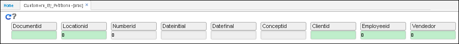
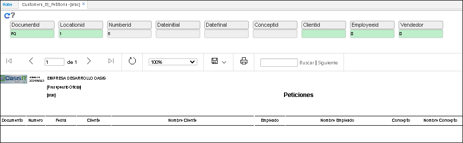

# Peticiones - ARAC  

Reporte del modulo de atencion, donde se consulta cada una de los P.Q.R. **Peticiones, Quejas y Reclamos** que se documentan desde el **ACAS.**   

Datos de entrada para la consulta:  

  
**Documento:**  parametrizacion realizada desde el BDOC.  
**Ubicacion:**   parametrizacion realizada en BUBI.  
**Numero:**  consecutivo.  
**Fecha inicial:**  rango inicial de data.  
**Fecha final: ** rango final de data.  
**Concepto:**   parametrizacion realizada desde el BCON y BDOC.   
**Cliente: **  parametrizacion realizada en basico de terceros BTER.   
**Empleado: **  parametrizacion realizada en basico de terceros BTER.  
**Vendedor: ** parametrizacion realizada en basico de terceros BTER.  

  

