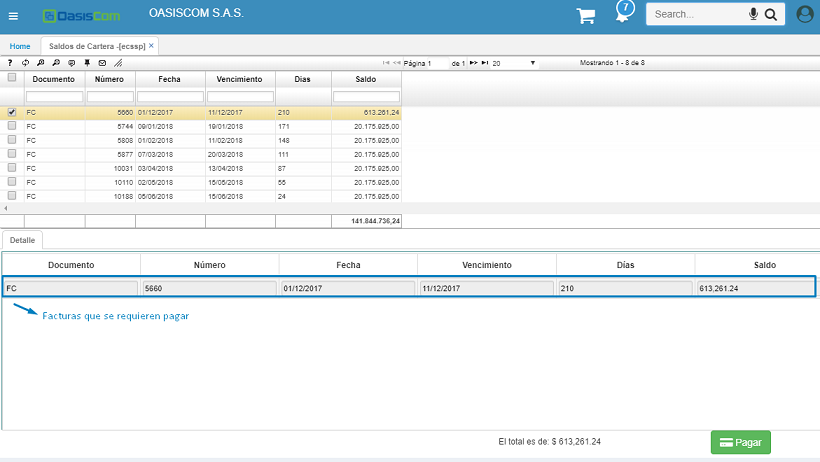
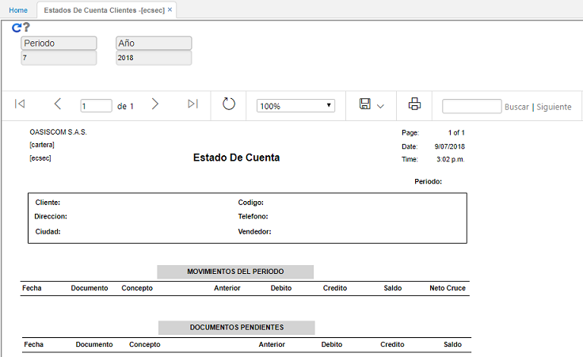

# Clientes

El portal de clientes consta de aplicaciones en donde el usuario que inició sesión puede ver únicamente su información correspondiente a saldo de cartera, estado de cuenta del cliente y colocación de pedidos.

Está integrado por los módulos:

* [**EVPED**](http://docs.oasiscom.com/Operacion/crm/portal/cliente/evped) - Colocar Pedidos
* [**EACAS**](http://docs.oasiscom.com/Operacion/crm/portal/cliente/eacas) - Colocar Casos de Soporte
* [**ECSEC**](http://docs.oasiscom.com/Operacion/crm/portal/cliente/ecsec) - Estados de Cuenta Clientes
* [**EASEC**](http://docs.oasiscom.com/Operacion/crm/portal/cliente/easec) - Reporte de Casos
* [**EEAPO**](http://docs.oasiscom.com/Operacion/crm/portal/cliente/eeapo) - Formulario de Empleadores
* [**EESOP**](http://docs.oasiscom.com/Operacion/crm/portal/cliente/eesop) - Aplicación de Afiliados WEB
* [**EEMOV**](http://docs.oasiscom.com/Operacion/crm/portal/cliente/eemov) - Formulación de Afiliados WEB
* [**EAOPO**](http://docs.oasiscom.com/Operacion/crm/portal/cliente/eaopo) - Oportunidades  
* [**ECSSP**](http://docs.oasiscom.com/Operacion/erp/cartera/saldo/ecssp) - Saldo de Cartera

Para poder consultas estas aplicaciones se debe crear un rol que se llame Portal de Clientes y otorgarle a los clientes permisos a estas aplicaciones, así mismo en el **SUSU - Usuario** se debe tener asociada la cédula a la persona que corresponde (campo tercero), esto con el fin que sólo se pueda ver la información del usuario que se logea:

**ECSSP - Saldo de Cartera:** Allí aparecen todas las facturas que se encuentran con saldo, se puede observar el número de la factura, fecha, fecha de vencimiento, días de mora y saldo correspondiente. Así mismo en la parte inferior aparecerán las facturas seleccionadas del maestro y que se requieran pagar directamente desde OasisCom.

**ECSEC - Estado de Cuenta de Cliente:** Se debe registrar el filtro de periodo y año, una vez consultado aparece el estado de cuenta del cliente, con sus respectivos datos generales, los movimientos (facturas y notas) registrados en el periodo y los documentos pendientes a la fecha.

[**EVPED - Colocar Pedidos:**](http://docs.oasiscom.com/Operacion/mpportal/mpproveedor/evped) Allí aparece una pantalla en donde se puede seleccionar los productos/servicios que se requieren solicitar, se adicionan al carrito de compras y cuando ya está finalizado se envía para que Oasis identifique el pedido realizado y se realice todo el proceso para la venta y entrega del mismo.

