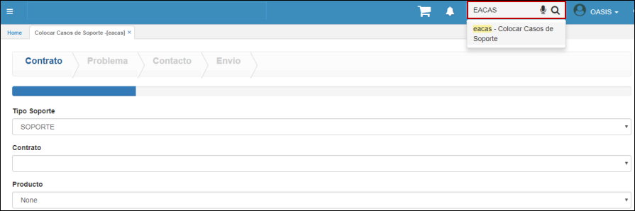
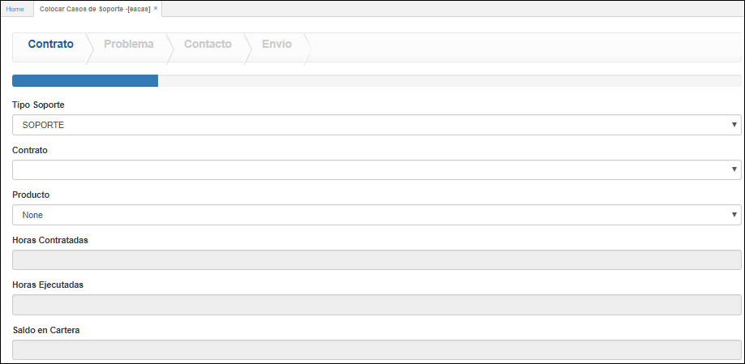
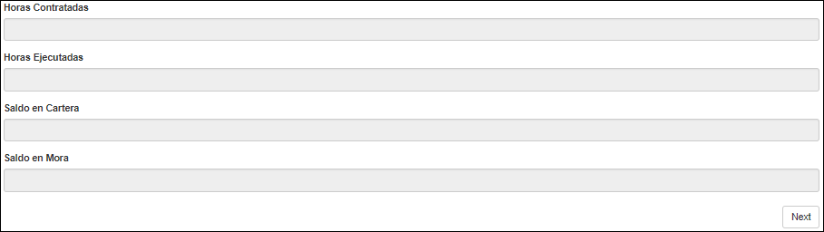
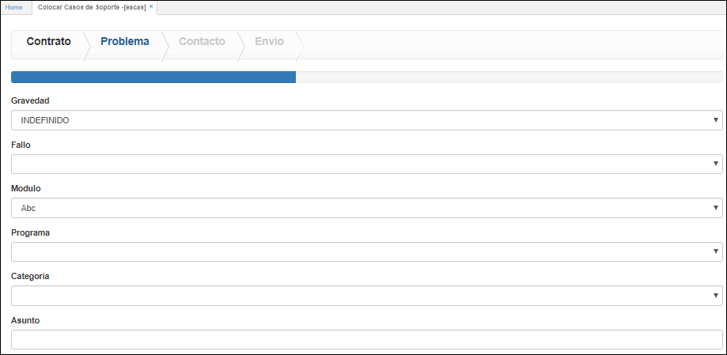
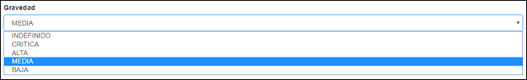
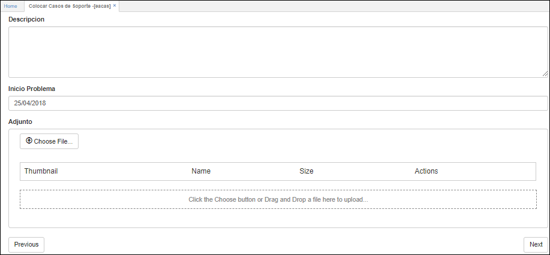
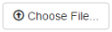
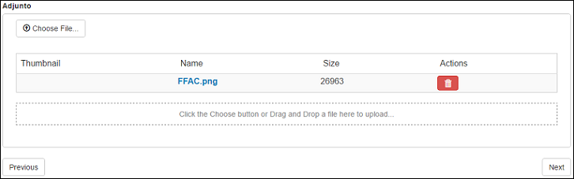
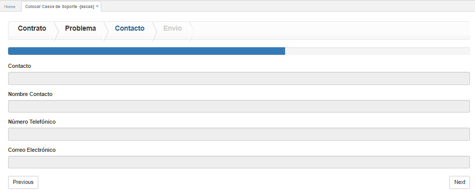
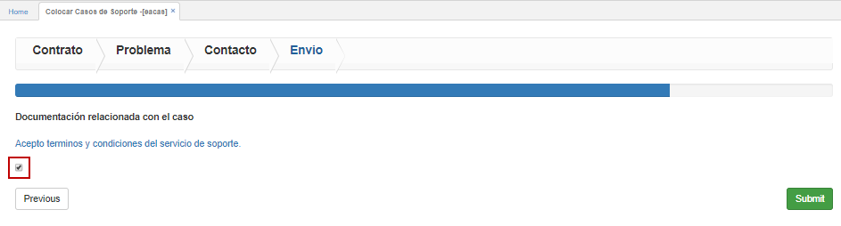

## EACAS - Colorcar Casos de Soporte

La aplicación EACAS permite a los clientes de cada empresa realizar el cargue de casos de soporte al sistema OasisCom, estos casos serán administrados por cada empresa.  

Para cargar casos de soporte en el sistema OasisCom ingresaremos a la aplicación **EACAS - Colocar Casos de Soporte**.  

Ubicados en la aplicación **EACAS - Colocar Casos de Soporte**, se observarán cuatro pestañas (Contrato, Problema, Contacto, Envío), correspondientes al proceso para el envío del caso de soporte, estas pestañas se deberán diligenciar consecutivamente.  

#### Contrato

En esta pestaña se ingresan los datos correspondientes al contrato de soporte que tiene el cliente con la empresa, igualmente, muestra las horas contratadas de soporte según el contrato, las horas ejecutadas a la fecha, el saldo que se encuentra en cartera y el saldo en mora, de haberlo.  

**Tipo de soporte:** seleccionar el tipo de soporte contratado con la empresa.  
**Contrato:** seleccionar el tipo de contrato.  
**Producto:** seleccionar el tipo de soporte o producto que se acordó en el contrato.   

Seguidamente, se encuentran campos de información que no son editables pero se deben tener en cuenta para el cargue de casos de soporte.  

Diligenciado el formulario damos click en el botón _Next_, el cual nos trasladará a la siguiente pestaña **Problema**.  

#### Problema

En esta pestaña se ingresa la información que describe el problema por el cual se requiere cargar el caso de soporte.  

**Gravedad:** seleccionar de la lista desplegable la gravedad del problema que se va a reportar. 

**Falla:** seleccionar de la lista desplegable el tipo de falla que está presentando el sistema y por el cual se requiere cargar un caso de soporte.  
**Módulo:** seleccionar el módulo en el cual se está presentando el problema.  
**Programa:** seleccionar de la lista el programa del módulo en donde se presenta el problema a reportar.  
**Categoría:** seleccionar la categoría con la cual se puede relacionar la falla que se va a reportar.  
**Asunto:** escribir puntualmente el problema que se desea reportar.  

Deslizamos la ventana y diligenciamos la parte inferior del formato.

**Descripción:** realizar una descripción detallada del caso de soporte que se va a reportar.  
**Inicio problema:** seleccionar la fecha desde la cual ha presenciado el problema.  
**Adjunto:** el sistema permite adjuntar imágenes o capturas de pantalla del problema que se está presentando con el fin de hacer más explícita la descripción del mismo.  

Para adjuntar un archivo, damos click en el botón  y seleccionamos de la ventana emergente la imagen correspondiente a la falla a reportar. Este proceso se puede repetir para cargar varias imágenes.  

Cargadas las imágenes damos click en el botón _Next_ para continuar a la siguiente pestaña de la aplicación.  

#### Contacto

En la pestaña contacto, se podrá observar los datos de la persona a la cual le llegarán los correos electrónicos de seguimiento del caso. Dicha persona es definida por el cliente.  

Verificados los datos damos click en el botón _Next_ para pasar a la siguiente pestaña **Envío**.  

#### Envío

Para envíar el caso de soporte es necesario leer y aceptar los términos y condiciones del servicio de soporte, estos se pueden ver dando click en el link  y se aceptan activando el flag .  

Finalmente, damos click en el botón  y el caso será creado, el sistema arrojará el número asignado al caso con el cual se podrá realizar seguimiento en la aplicación [**EASEG - Monitoreo de Casos**](http://docs.oasiscom.com/Operacion/system/sacceso/easeg).
